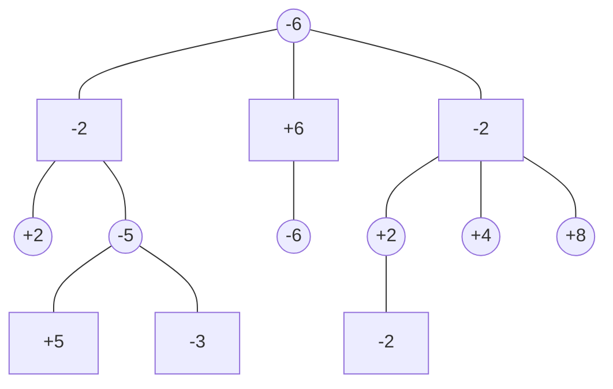

<script type="text/javascript" id="MathJax-script" async
  src="https://cdn.jsdelivr.net/npm/mathjax@3/es5/tex-mml-chtml.js">
</script>
<script>
  window.MathJax = {
    tex: { inlineMath: [['$', '$'], ['\\(', '\\)']] }
  };
</script>

# NICE Chess Engine ♟️

## Overview

The **Not Intelligent Chess Engine**, otherwise known as **NICE**, is a UCI chess engine that implements key learning principles using low-level languages. NICE is developed in **C++** for speed and efficiency, allowing us to utilize low-level operations and CPU instructions to further speed up the engine. The engine uses **Data-Oriented Design** principles, prioritizing performance over object-oriented data representation.

NICE is live on Lichess for all to try, challenge, and test its strength. It is comparable to Stockfish Level 5, with an estimated Elo rating of **1500-1700**.

<div style="text-align: center; margin: 2rem 0;">
  <a href="https://lichess.org/@/NICE_BOT" style="display: inline-block; padding: 12px 24px; background: linear-gradient(45deg, #667eea, #764ba2); color: white; text-decoration: none; border-radius: 8px; font-weight: 600;">
    🎮 Play Against NICE on Lichess
  </a>
</div>

---

## Technical Highlights

- **Board Representation**: Hybrid approach using Bitboards and Mailbox
- **Move Generation**: Optimized for sliders and leapers with precomputed lookup tables
- **Search Algorithm**: Negamax with Alpha-Beta pruning
- **Evaluation**: Material + Piece-Square Tables
- **Performance**: ~1500-1700 Elo rating

---

# Board Representation

There are typically 2 ways to represent they game board in an engine: **Mailbox** and **Bitboards**. 

## Approach 1: Mailbox

Mailbox is the more intuitive approach where the board is represented as an **array of 64 elements** where each element contains the ID of what type of piece is on that square.

### Advantages ✅
- **Ultra-fast lookup speed**: $O(1)$ time complexity to check what piece is on any specific square
- Perfect for checking if a square is occupied or capturing pieces

### Disadvantages ❌
- **Inefficient piece location**: Must loop through entire 64-element array to find pieces
- Even with only 3 pieces on the board, must scan all 64 squares
- No quick way to know where pieces are without iteration

---

## Approach 2: Bitboards

Bitboard is a way of compressing the idea of the mailbox into a **single 64-bit integer**. It leverages the fact that there are 64 squares on the board and that modern computer hardware and CPUs have a 64-bit architecture. This means we can fit information of an entire board inside a single CPU register.

### Why This Matters
Each bit in the 64-bit integer represents one square on the board. If the bit is `1`, there's a piece on that square. If it's `0`, the square is empty.

<table cellspacing="0" cellpadding="0" style="border: 4px solid #333; border-collapse: collapse; margin: 0 auto; font-family: 'Segoe UI Symbol', 'Arial Unicode MS', sans-serif;">
  <tr>
    <td style="width: 50px; height: 50px; padding:0; line-height: 50px; text-align: center; font-size: 25px; background-color: #f0d9b5; color: #b58863;">56</td>
    <td style="width: 50px; height: 50px; padding:0; line-height: 50px; text-align: center; font-size: 25px; background-color: #b58863; color: #f0d9b5;">57</td>
    <td style="width: 50px; height: 50px; padding:0; line-height: 50px; text-align: center; font-size: 25px; background-color: #f0d9b5; color: #b58863;">58</td>
    <td style="width: 50px; height: 50px; padding:0; line-height: 50px; text-align: center; font-size: 25px; background-color: #b58863; color: #f0d9b5;">59</td>
    <td style="width: 50px; height: 50px; padding:0; line-height: 50px; text-align: center; font-size: 25px; background-color: #f0d9b5; color: #b58863;">60</td>
    <td style="width: 50px; height: 50px; padding:0; line-height: 50px; text-align: center; font-size: 25px; background-color: #b58863; color: #f0d9b5;">61</td>
    <td style="width: 50px; height: 50px; padding:0; line-height: 50px; text-align: center; font-size: 25px; background-color: #f0d9b5; color: #b58863;">62</td>
    <td style="width: 50px; height: 50px; padding:0; line-height: 50px; text-align: center; font-size: 25px; background-color: #b58863; color: #f0d9b5;">63</td>
  </tr>
  <tr>
    <td style="width: 50px; height: 50px; padding:0; line-height: 50px; text-align: center; font-size: 25px; background-color: #b58863; color: #f0d9b5;">48</td>
    <td style="width: 50px; height: 50px; padding:0; line-height: 50px; text-align: center; font-size: 25px; background-color: #f0d9b5; color: #b58863;">49</td>
    <td style="width: 50px; height: 50px; padding:0; line-height: 50px; text-align: center; font-size: 25px; background-color: #b58863; color: #f0d9b5;">50</td>
    <td style="width: 50px; height: 50px; padding:0; line-height: 50px; text-align: center; font-size: 25px; background-color: #f0d9b5; color: #b58863;">51</td>
    <td style="width: 50px; height: 50px; padding:0; line-height: 50px; text-align: center; font-size: 25px; background-color: #b58863; color: #f0d9b5;">52</td>
    <td style="width: 50px; height: 50px; padding:0; line-height: 50px; text-align: center; font-size: 25px; background-color: #f0d9b5; color: #b58863;">53</td>
    <td style="width: 50px; height: 50px; padding:0; line-height: 50px; text-align: center; font-size: 25px; background-color: #b58863; color: #f0d9b5;">54</td>
    <td style="width: 50px; height: 50px; padding:0; line-height: 50px; text-align: center; font-size: 25px; background-color: #f0d9b5; color: #b58863;">55</td>
  </tr>
  <tr>
    <td style="width: 50px; height: 50px; padding:0; line-height: 50px; text-align: center; font-size: 25px; background-color: #f0d9b5; color: #b58863;">40</td>
    <td style="width: 50px; height: 50px; padding:0; line-height: 50px; text-align: center; font-size: 25px; background-color: #b58863; color: #f0d9b5;">41</td>
    <td style="width: 50px; height: 50px; padding:0; line-height: 50px; text-align: center; font-size: 25px; background-color: #f0d9b5; color: #b58863;">42</td>
    <td style="width: 50px; height: 50px; padding:0; line-height: 50px; text-align: center; font-size: 25px; background-color: #b58863; color: #f0d9b5;">43</td>
    <td style="width: 50px; height: 50px; padding:0; line-height: 50px; text-align: center; font-size: 25px; background-color: #f0d9b5; color: #b58863;">44</td>
    <td style="width: 50px; height: 50px; padding:0; line-height: 50px; text-align: center; font-size: 25px; background-color: #b58863; color: #f0d9b5;">45</td>
    <td style="width: 50px; height: 50px; padding:0; line-height: 50px; text-align: center; font-size: 25px; background-color: #f0d9b5; color: #b58863;">46</td>
    <td style="width: 50px; height: 50px; padding:0; line-height: 50px; text-align: center; font-size: 25px; background-color: #b58863; color: #f0d9b5;">47</td>
  </tr>
  <tr>
    <td style="width: 50px; height: 50px; padding:0; line-height: 50px; text-align: center; font-size: 25px; background-color: #b58863; color: #f0d9b5;">32</td>
    <td style="width: 50px; height: 50px; padding:0; line-height: 50px; text-align: center; font-size: 25px; background-color: #f0d9b5; color: #b58863;">33</td>
    <td style="width: 50px; height: 50px; padding:0; line-height: 50px; text-align: center; font-size: 25px; background-color: #b58863; color: #f0d9b5;">34</td>
    <td style="width: 50px; height: 50px; padding:0; line-height: 50px; text-align: center; font-size: 25px; background-color: #f0d9b5; color: #b58863;">35</td>
    <td style="width: 50px; height: 50px; padding:0; line-height: 50px; text-align: center; font-size: 25px; background-color: #b58863; color: #f0d9b5;">36</td>
    <td style="width: 50px; height: 50px; padding:0; line-height: 50px; text-align: center; font-size: 25px; background-color: #f0d9b5; color: #b58863;">37</td>
    <td style="width: 50px; height: 50px; padding:0; line-height: 50px; text-align: center; font-size: 25px; background-color: #b58863; color: #f0d9b5;">38</td>
    <td style="width: 50px; height: 50px; padding:0; line-height: 50px; text-align: center; font-size: 25px; background-color: #f0d9b5; color: #b58863;">39</td>
  </tr>
  <tr>
    <td style="width: 50px; height: 50px; padding:0; line-height: 50px; text-align: center; font-size: 25px; background-color: #f0d9b5; color: #b58863;">24</td>
    <td style="width: 50px; height: 50px; padding:0; line-height: 50px; text-align: center; font-size: 25px; background-color: #b58863; color: #f0d9b5;">25</td>
    <td style="width: 50px; height: 50px; padding:0; line-height: 50px; text-align: center; font-size: 25px; background-color: #f0d9b5; color: #b58863;">26</td>
    <td style="width: 50px; height: 50px; padding:0; line-height: 50px; text-align: center; font-size: 25px; background-color: #b58863; color: #f0d9b5;">27</td>
    <td style="width: 50px; height: 50px; padding:0; line-height: 50px; text-align: center; font-size: 25px; background-color: #f0d9b5; color: #b58863;">28</td>
    <td style="width: 50px; height: 50px; padding:0; line-height: 50px; text-align: center; font-size: 25px; background-color: #b58863; color: #f0d9b5;">29</td>
    <td style="width: 50px; height: 50px; padding:0; line-height: 50px; text-align: center; font-size: 25px; background-color: #f0d9b5; color: #b58863;">30</td>
    <td style="width: 50px; height: 50px; padding:0; line-height: 50px; text-align: center; font-size: 25px; background-color: #b58863; color: #f0d9b5;">31</td>
  </tr>
  <tr>
    <td style="width: 50px; height: 50px; padding:0; line-height: 50px; text-align: center; font-size: 25px; background-color: #b58863; color: #f0d9b5;">16</td>
    <td style="width: 50px; height: 50px; padding:0; line-height: 50px; text-align: center; font-size: 25px; background-color: #f0d9b5; color: #b58863;">17</td>
    <td style="width: 50px; height: 50px; padding:0; line-height: 50px; text-align: center; font-size: 25px; background-color: #b58863; color: #f0d9b5;">18</td>
    <td style="width: 50px; height: 50px; padding:0; line-height: 50px; text-align: center; font-size: 25px; background-color: #f0d9b5; color: #b58863;">19</td>
    <td style="width: 50px; height: 50px; padding:0; line-height: 50px; text-align: center; font-size: 25px; background-color: #b58863; color: #f0d9b5;">20</td>
    <td style="width: 50px; height: 50px; padding:0; line-height: 50px; text-align: center; font-size: 25px; background-color: #f0d9b5; color: #b58863;">21</td>
    <td style="width: 50px; height: 50px; padding:0; line-height: 50px; text-align: center; font-size: 25px; background-color: #b58863; color: #f0d9b5;">22</td>
    <td style="width: 50px; height: 50px; padding:0; line-height: 50px; text-align: center; font-size: 25px; background-color: #f0d9b5; color: #b58863;">23</td>
  </tr>
  <tr>
    <td style="width: 50px; height: 50px; padding:0; line-height: 50px; text-align: center; font-size: 25px; background-color: #f0d9b5; color: #b58863;">8</td>
    <td style="width: 50px; height: 50px; padding:0; line-height: 50px; text-align: center; font-size: 25px; background-color: #b58863; color: #f0d9b5;">9</td>
    <td style="width: 50px; height: 50px; padding:0; line-height: 50px; text-align: center; font-size: 25px; background-color: #f0d9b5; color: #b58863;">10</td>
    <td style="width: 50px; height: 50px; padding:0; line-height: 50px; text-align: center; font-size: 25px; background-color: #b58863; color: #f0d9b5;">11</td>
    <td style="width: 50px; height: 50px; padding:0; line-height: 50px; text-align: center; font-size: 25px; background-color: #f0d9b5; color: #b58863;">12</td>
    <td style="width: 50px; height: 50px; padding:0; line-height: 50px; text-align: center; font-size: 25px; background-color: #b58863; color: #f0d9b5;">13</td>
    <td style="width: 50px; height: 50px; padding:0; line-height: 50px; text-align: center; font-size: 25px; background-color: #f0d9b5; color: #b58863;">14</td>
    <td style="width: 50px; height: 50px; padding:0; line-height: 50px; text-align: center; font-size: 25px; background-color: #b58863; color: #f0d9b5;">15</td>
  </tr>
  <tr>
    <td style="width: 50px; height: 50px; padding:0; line-height: 50px; text-align: center; font-size: 25px; background-color: #b58863; color: #f0d9b5;">0</td>
    <td style="width: 50px; height: 50px; padding:0; line-height: 50px; text-align: center; font-size: 25px; background-color: #f0d9b5; color: #b58863;">1</td>
    <td style="width: 50px; height: 50px; padding:0; line-height: 50px; text-align: center; font-size: 25px; background-color: #b58863; color: #f0d9b5;">2</td>
    <td style="width: 50px; height: 50px; padding:0; line-height: 50px; text-align: center; font-size: 25px; background-color: #f0d9b5; color: #b58863;">3</td>
    <td style="width: 50px; height: 50px; padding:0; line-height: 50px; text-align: center; font-size: 25px; background-color: #b58863; color: #f0d9b5;">4</td>
    <td style="width: 50px; height: 50px; padding:0; line-height: 50px; text-align: center; font-size: 25px; background-color: #f0d9b5; color: #b58863;">5</td>
    <td style="width: 50px; height: 50px; padding:0; line-height: 50px; text-align: center; font-size: 25px; background-color: #b58863; color: #f0d9b5;">6</td>
    <td style="width: 50px; height: 50px; padding:0; line-height: 50px; text-align: center; font-size: 25px; background-color: #f0d9b5; color: #b58863;">7</td>
  </tr>
</table>

If we visualise the board being numbered as show above, we can map each square to 1 bit in a 64 bit unsigned integer.

<table cellspacing="0" cellpadding="0" style="border: 4px solid #333; border-collapse: collapse; margin: 0 auto; font-family: 'Segoe UI Symbol', 'Arial Unicode MS', sans-serif;">
  <tr>
    <td style="width: 50px; height: 50px; padding:0; line-height: 50px; text-align: center; font-size: 25px; background-color: #f0d9b5; color: #b58863;">56</td>
    <td style="width: 50px; height: 50px; padding:0; line-height: 50px; text-align: center; font-size: 25px; background-color: #b58863; color: #f0d9b5;">57</td>
    <td style="width: 50px; height: 50px; padding:0; line-height: 50px; text-align: center; font-size: 25px; background-color: #f0d9b5; color: #b58863;">58</td>
    <td style="width: 50px; height: 50px; padding:0; line-height: 50px; text-align: center; font-size: 25px; background-color: #b58863; color: #f0d9b5;">59</td>
    <td style="width: 50px; height: 50px; padding:0; line-height: 50px; text-align: center; font-size: 25px; background-color: #f0d9b5; color: #b58863;">60</td>
    <td style="width: 50px; height: 50px; padding:0; line-height: 50px; text-align: center; font-size: 25px; background-color: #b58863; color: #f0d9b5;">61</td>
    <td style="width: 50px; height: 50px; padding:0; line-height: 50px; text-align: center; font-size: 25px; background-color: #f0d9b5; color: #b58863;">62</td>
    <td style="width: 50px; height: 50px; padding:0; line-height: 50px; text-align: center; font-size: 25px; background-color: #b58863; color: #f0d9b5;">63</td>
  </tr>
  <tr>
    <td style="width: 50px; height: 50px; padding:0; line-height: 50px; text-align: center; font-size: 25px; background-color: #b58863; color: #f0d9b5;">48</td>
    <td style="width: 50px; height: 50px; padding:0; line-height: 50px; text-align: center; font-size: 25px; background-color: #f0d9b5; color: #b58863;">49</td>
    <td style="width: 50px; height: 50px; padding:0; line-height: 50px; text-align: center; font-size: 25px; background-color: #b58863; color: #f0d9b5;">50</td>
    <td style="width: 50px; height: 50px; padding:0; line-height: 50px; text-align: center; font-size: 25px; background-color: #f0d9b5; color: #b58863;">51</td>
    <td style="width: 50px; height: 50px; padding:0; line-height: 50px; text-align: center; font-size: 25px; background-color: #b58863; color: #f0d9b5;">52</td>
    <td style="width: 50px; height: 50px; padding:0; line-height: 50px; text-align: center; font-size: 25px; background-color: #f0d9b5; color: #b58863;">53</td>
    <td style="width: 50px; height: 50px; padding:0; line-height: 50px; text-align: center; font-size: 25px; background-color: #b58863; color: #f0d9b5;">54</td>
    <td style="width: 50px; height: 50px; padding:0; line-height: 50px; text-align: center; font-size: 25px; background-color: #f0d9b5; color: #b58863;">55</td>
  </tr>
  <tr>
    <td style="width: 50px; height: 50px; padding:0; line-height: 50px; text-align: center; font-size: 25px; background-color: #f0d9b5; color: #b58863;">40</td>
    <td style="width: 50px; height: 50px; padding:0; line-height: 50px; text-align: center; font-size: 25px; background-color: #b58863; color: #f0d9b5;">41</td>
    <td style="width: 50px; height: 50px; padding:0; line-height: 50px; text-align: center; font-size: 25px; background-color: #f0d9b5; color: #b58863;">42</td>
    <td style="width: 50px; height: 50px; padding:0; line-height: 50px; text-align: center; font-size: 25px; background-color: #b58863; color: #f0d9b5;">43</td>
    <td style="width: 50px; height: 50px; padding:0; line-height: 50px; text-align: center; font-size: 25px; background-color: #f0d9b5; color: #b58863;">44</td>
    <td style="width: 50px; height: 50px; padding:0; line-height: 50px; text-align: center; font-size: 25px; background-color: #b58863; color: #f0d9b5;">45</td>
    <td style="width: 50px; height: 50px; padding:0; line-height: 50px; text-align: center; font-size: 25px; background-color: #f0d9b5; color: #b58863;">46</td>
    <td style="width: 50px; height: 50px; padding:0; line-height: 50px; text-align: center; font-size: 25px; background-color: #b58863; color: #f0d9b5;">47</td>
  </tr>
  <tr>
    <td style="width: 50px; height: 50px; padding:0; line-height: 50px; text-align: center; font-size: 25px; background-color: #b58863; color: #f0d9b5;">32</td>
    <td style="width: 50px; height: 50px; padding:0; line-height: 50px; text-align: center; font-size: 25px; background-color: #f0d9b5; color: #b58863;">33</td>
    <td style="width: 50px; height: 50px; padding:0; line-height: 50px; text-align: center; font-size: 25px; background-color: #b58863; color: #f0d9b5;">34</td>
    <td style="width: 50px; height: 50px; padding:0; line-height: 50px; text-align: center; font-size: 25px; background-color: #f0d9b5; color: #b58863;">35</td>
    <td style="width: 50px; height: 50px; padding:0; line-height: 50px; text-align: center; font-size: 25px; background-color: #b58863; color: #f0d9b5;">36</td>
    <td style="width: 50px; height: 50px; padding:0; line-height: 50px; text-align: center; font-size: 25px; background-color: #f0d9b5; color: #b58863;">37</td>
    <td style="width: 50px; height: 50px; padding:0; line-height: 50px; text-align: center; font-size: 25px; background-color: #b58863; color: #f0d9b5;">38</td>
    <td style="width: 50px; height: 50px; padding:0; line-height: 50px; text-align: center; font-size: 25px; background-color: #f0d9b5; color: #b58863;">39</td>
  </tr>
  <tr>
    <td style="width: 50px; height: 50px; padding:0; line-height: 50px; text-align: center; font-size: 25px; background-color: #f0d9b5; color: #b58863;">24</td>
    <td style="width: 50px; height: 50px; padding:0; line-height: 50px; text-align: center; font-size: 25px; background-color: #b58863; color: #f0d9b5;">25</td>
    <td style="width: 50px; height: 50px; padding:0; line-height: 50px; text-align: center; font-size: 25px; background-color: #f0d9b5; color: #b58863;">26</td>
    <td style="width: 50px; height: 50px; padding:0; line-height: 50px; text-align: center; font-size: 25px; background-color: #b58863; color: #f0d9b5;">27</td>
    <td style="width: 50px; height: 50px; padding:0; line-height: 50px; text-align: center; font-size: 25px; background-color: #f0d9b5; color: #b58863;">28</td>
    <td style="width: 50px; height: 50px; padding:0; line-height: 50px; text-align: center; font-size: 25px; background-color: #b58863; color: #f0d9b5;">29</td>
    <td style="width: 50px; height: 50px; padding:0; line-height: 50px; text-align: center; font-size: 25px; background-color: #f0d9b5; color: #b58863;">30</td>
    <td style="width: 50px; height: 50px; padding:0; line-height: 50px; text-align: center; font-size: 25px; background-color: #b58863; color: #f0d9b5;">31</td>
  </tr>
  <tr>
    <td style="width: 50px; height: 50px; padding:0; line-height: 50px; text-align: center; font-size: 25px; background-color: #b58863; color: #f0d9b5;">16</td>
    <td style="width: 50px; height: 50px; padding:0; line-height: 50px; text-align: center; font-size: 25px; background-color: #f0d9b5; color: #b58863;">17</td>
    <td style="width: 50px; height: 50px; padding:0; line-height: 50px; text-align: center; font-size: 25px; background-color: #b58863; color: #f0d9b5;">18</td>
    <td style="width: 50px; height: 50px; padding:0; line-height: 50px; text-align: center; font-size: 25px; background-color: #f0d9b5; color: #b58863;">19</td>
    <td style="width: 50px; height: 50px; padding:0; line-height: 50px; text-align: center; font-size: 25px; background-color: #b58863; color: #f0d9b5;">20</td>
    <td style="width: 50px; height: 50px; padding:0; line-height: 50px; text-align: center; font-size: 25px; background-color: #f0d9b5; color: #b58863;">21</td>
    <td style="width: 50px; height: 50px; padding:0; line-height: 50px; text-align: center; font-size: 25px; background-color: #b58863; color: #f0d9b5;">22</td>
    <td style="width: 50px; height: 50px; padding:0; line-height: 50px; text-align: center; font-size: 25px; background-color: #f0d9b5; color: #b58863;">23</td>
  </tr>
  <tr>
    <td style="width: 50px; height: 50px; padding:0; line-height: 50px; text-align: center; font-size: 25px; background-color: #f0d9b5; color: black;">♙</td>
    <td style="width: 50px; height: 50px; padding:0; line-height: 50px; text-align: center; font-size: 25px; background-color: #b58863; color: black;">♙</td>
    <td style="width: 50px; height: 50px; padding:0; line-height: 50px; text-align: center; font-size: 25px; background-color: #f0d9b5; color: black;">♙</td>
    <td style="width: 50px; height: 50px; padding:0; line-height: 50px; text-align: center; font-size: 25px; background-color: #b58863; color: black;">♙</td>
    <td style="width: 50px; height: 50px; padding:0; line-height: 50px; text-align: center; font-size: 25px; background-color: #f0d9b5; color: black;">♙</td>
    <td style="width: 50px; height: 50px; padding:0; line-height: 50px; text-align: center; font-size: 25px; background-color: #b58863; color: black;">♙</td>
    <td style="width: 50px; height: 50px; padding:0; line-height: 50px; text-align: center; font-size: 25px; background-color: #f0d9b5; color: black;">♙</td>
    <td style="width: 50px; height: 50px; padding:0; line-height: 50px; text-align: center; font-size: 25px; background-color: #b58863; color: black;">♙</td>
  </tr>
  <tr>
    <td style="width: 50px; height: 50px; padding:0; line-height: 50px; text-align: center; font-size: 25px; background-color: #b58863; color: #f0d9b5;">0</td>
    <td style="width: 50px; height: 50px; padding:0; line-height: 50px; text-align: center; font-size: 25px; background-color: #f0d9b5; color: #b58863;">1</td>
    <td style="width: 50px; height: 50px; padding:0; line-height: 50px; text-align: center; font-size: 25px; background-color: #b58863; color: #f0d9b5;">2</td>
    <td style="width: 50px; height: 50px; padding:0; line-height: 50px; text-align: center; font-size: 25px; background-color: #f0d9b5; color: #b58863;">3</td>
    <td style="width: 50px; height: 50px; padding:0; line-height: 50px; text-align: center; font-size: 25px; background-color: #b58863; color: #f0d9b5;">4</td>
    <td style="width: 50px; height: 50px; padding:0; line-height: 50px; text-align: center; font-size: 25px; background-color: #f0d9b5; color: #b58863;">5</td>
    <td style="width: 50px; height: 50px; padding:0; line-height: 50px; text-align: center; font-size: 25px; background-color: #b58863; color: #f0d9b5;">6</td>
    <td style="width: 50px; height: 50px; padding:0; line-height: 50px; text-align: center; font-size: 25px; background-color: #f0d9b5; color: #b58863;">7</td>
  </tr>
</table>

The board above with pawns can be represented internally as:

```
0b00000000 00000000 00000000 00000000 00000000 00000000 11111111 00000000
```

In this example, bits 8 to 15 have been flipped to `1`, representing pieces occupying those squares.

### Advantages ✅
- **Lightning-fast move generation**: All move generation is bitwise operations
- **Instant attacked square checks**: Simple bitmask application
- **Fast piece counting**: CPU instructions like `LSB` and `PopCount` give instant results
- **Compact memory footprint**: 13 bitboards = 104 bytes vs Mailbox = 252 bytes

### Disadvantages ❌
- **No piece type information**: Only shows occupied/empty, not what piece is there
- **Multiple bitboards needed**: One for each piece type (13 total for NICE)

---

## The Solution: Hybrid Approach 🎯

The hybrid approach combines **both Bitboards and Mailbox**. Notice how the strengths of one representation perfectly complement the weaknesses of the other!

### How NICE Uses Both
- **Bitboards** for fast move generation and attack queries
- **Mailbox** for instant piece-type lookups

### The Trade-off
The only overhead is ensuring both representations stay **synchronized** to prevent board corruption. This is a small price to pay for the combined benefits of both approaches!

---

# Move Generation

## Move Encoding

A move is represented as a **compact 32-bit integer** for maximum efficiency and minimal memory footprint.

### Bit Layout

| Bits | Purpose | Range |
|------|---------|-------|
| 0-5 | From square | 0-63 |
| 6-11 | To square | 0-63 |
| 12-17 | Flags | Castling, en passant, captures |
| 18-21 | Promoted to | Piece type |
| 22-25 | Piece captured | Piece type |

This compact representation means each move takes just **4 bytes** of memory!

---

## Movement Categories

Chess pieces fall into two fundamental categories based on how they move:

### 🔹 Sliders
Pieces that **slide** across the board until hitting another piece or the edge
- **Rooks** (horizontal/vertical)
- **Bishops** (diagonal)
- **Queens** (all directions)

### 🔸 Leapers  
Pieces that **"teleport"** to their destination without blockers affecting them
- **Knights** (L-shape jumps)
- **Kings** (one square any direction)
- **Pawns** (special case: move like sliders, capture like leapers)

---

### Slider Move Generation

Using **directional offsets**, we calculate the next position iteratively. The process loops until:
- A blocker (piece) is encountered
- The edge of the board is reached

The offsets act as **cardinal directions** for movement:

<table cellspacing="0" cellpadding="0" style="border: 4px solid #333; border-collapse: collapse; margin: 0 auto; font-family: 'Segoe UI Symbol', 'Arial Unicode MS', sans-serif;">
  <tr>
    <td style="width: 50px; height: 50px; padding:0; line-height: 50px; text-align: center; font-size: 25px; background-color: #f0d9b5; color: #b58863;"></td>
    <td style="width: 50px; height: 50px; padding:0; line-height: 50px; text-align: center; font-size: 25px; background-color: #b58863; color: #f0d9b5;"></td>
    <td style="width: 50px; height: 50px; padding:0; line-height: 50px; text-align: center; font-size: 25px; background-color: #f0d9b5; color: #b58863;"></td>
    <td style="width: 50px; height: 50px; padding:0; line-height: 50px; text-align: center; font-size: 25px; background-color: #b58863; color: #f0d9b5;"></td>
    <td style="width: 50px; height: 50px; padding:0; line-height: 50px; text-align: center; font-size: 25px; background-color: #f0d9b5; color: black;">+7</td>
    <td style="width: 50px; height: 50px; padding:0; line-height: 50px; text-align: center; font-size: 25px; background-color: #b58863; color: #f0d9b5;"></td>
    <td style="width: 50px; height: 50px; padding:0; line-height: 50px; text-align: center; font-size: 25px; background-color: #f0d9b5; color: black;">+9</td>
    <td style="width: 50px; height: 50px; padding:0; line-height: 50px; text-align: center; font-size: 25px; background-color: #b58863; color: #f0d9b5;"></td>
  </tr>
  <tr>
    <td style="width: 50px; height: 50px; padding:0; line-height: 50px; text-align: center; font-size: 25px; background-color: #b58863; color: #f0d9b5;"></td>
    <td style="width: 50px; height: 50px; padding:0; line-height: 50px; text-align: center; font-size: 25px; background-color: #f0d9b5; color: #b58863;"></td>
    <td style="width: 50px; height: 50px; padding:0; line-height: 50px; text-align: center; font-size: 25px; background-color: #b58863; color: #f0d9b5;"></td>
    <td style="width: 50px; height: 50px; padding:0; line-height: 50px; text-align: center; font-size: 25px; background-color: #f0d9b5; color: #b58863;"></td>
    <td style="width: 50px; height: 50px; padding:0; line-height: 50px; text-align: center; font-size: 25px; background-color: #b58863; color: #f0d9b5;"></td>
    <td style="width: 50px; height: 50px; padding:0; line-height: 50px; text-align: center; font-size: 25px; background-color: #f0d9b5; color: black;">♝</td>
    <td style="width: 50px; height: 50px; padding:0; line-height: 50px; text-align: center; font-size: 25px; background-color: #b58863; color: #f0d9b5;"></td>
    <td style="width: 50px; height: 50px; padding:0; line-height: 50px; text-align: center; font-size: 25px; background-color: #f0d9b5; color: #b58863;"></td>
  </tr>
  <tr>
    <td style="width: 50px; height: 50px; padding:0; line-height: 50px; text-align: center; font-size: 25px; background-color: #f0d9b5; color: #b58863;"></td>
    <td style="width: 50px; height: 50px; padding:0; line-height: 50px; text-align: center; font-size: 25px; background-color: #b58863; color: #f0d9b5;"></td>
    <td style="width: 50px; height: 50px; padding:0; line-height: 50px; text-align: center; font-size: 25px; background-color: #f0d9b5; color: #b58863;"></td>
    <td style="width: 50px; height: 50px; padding:0; line-height: 50px; text-align: center; font-size: 25px; background-color: #b58863; color: #f0d9b5;"></td>
    <td style="width: 50px; height: 50px; padding:0; line-height: 50px; text-align: center; font-size: 25px; background-color: #f0d9b5; color: black;">-9</td>
    <td style="width: 50px; height: 50px; padding:0; line-height: 50px; text-align: center; font-size: 25px; background-color: #b58863; color: #f0d9b5;"></td>
    <td style="width: 50px; height: 50px; padding:0; line-height: 50px; text-align: center; font-size: 25px; background-color: #f0d9b5; color: black;">-7</td>
    <td style="width: 50px; height: 50px; padding:0; line-height: 50px; text-align: center; font-size: 25px; background-color: #b58863; color: #f0d9b5;"></td>
  </tr>
  <tr>
    <td style="width: 50px; height: 50px; padding:0; line-height: 50px; text-align: center; font-size: 25px; background-color: #b58863; color: #f0d9b5;"></td>
    <td style="width: 50px; height: 50px; padding:0; line-height: 50px; text-align: center; font-size: 25px; background-color: #f0d9b5; color: #b58863;"></td>
    <td style="width: 50px; height: 50px; padding:0; line-height: 50px; text-align: center; font-size: 25px; background-color: #b58863; color: #f0d9b5;"></td>
    <td style="width: 50px; height: 50px; padding:0; line-height: 50px; text-align: center; font-size: 25px; background-color: #f0d9b5; color: black;">+8</td>
    <td style="width: 50px; height: 50px; padding:0; line-height: 50px; text-align: center; font-size: 25px; background-color: #b58863; color: #f0d9b5;"></td>
    <td style="width: 50px; height: 50px; padding:0; line-height: 50px; text-align: center; font-size: 25px; background-color: #f0d9b5; color: #b58863;"></td>
    <td style="width: 50px; height: 50px; padding:0; line-height: 50px; text-align: center; font-size: 25px; background-color: #b58863; color: #f0d9b5;"></td>
    <td style="width: 50px; height: 50px; padding:0; line-height: 50px; text-align: center; font-size: 25px; background-color: #f0d9b5; color: #b58863;"></td>
  </tr>
  <tr>
    <td style="width: 50px; height: 50px; padding:0; line-height: 50px; text-align: center; font-size: 25px; background-color: #f0d9b5; color: #b58863;"></td>
    <td style="width: 50px; height: 50px; padding:0; line-height: 50px; text-align: center; font-size: 25px; background-color: #b58863; color: #f0d9b5;"></td>
    <td style="width: 50px; height: 50px; padding:0; line-height: 50px; text-align: center; font-size: 25px; background-color: #f0d9b5; color: black;">-1</td>
    <td style="width: 50px; height: 50px; padding:0; line-height: 50px; text-align: center; font-size: 25px; background-color: #b58863; color: black;">♜</td>
    <td style="width: 50px; height: 50px; padding:0; line-height: 50px; text-align: center; font-size: 25px; background-color: #f0d9b5; color: black;">+1</td>
    <td style="width: 50px; height: 50px; padding:0; line-height: 50px; text-align: center; font-size: 25px; background-color: #b58863; color: #f0d9b5;"></td>
    <td style="width: 50px; height: 50px; padding:0; line-height: 50px; text-align: center; font-size: 25px; background-color: #f0d9b5; color: #b58863;"></td>
    <td style="width: 50px; height: 50px; padding:0; line-height: 50px; text-align: center; font-size: 25px; background-color: #b58863; color: #f0d9b5;"></td>
  </tr>
  <tr>
    <td style="width: 50px; height: 50px; padding:0; line-height: 50px; text-align: center; font-size: 25px; background-color: #b58863; color: #f0d9b5;"></td>
    <td style="width: 50px; height: 50px; padding:0; line-height: 50px; text-align: center; font-size: 25px; background-color: #f0d9b5; color: #b58863;"></td>
    <td style="width: 50px; height: 50px; padding:0; line-height: 50px; text-align: center; font-size: 25px; background-color: #b58863; color: #f0d9b5;"></td>
    <td style="width: 50px; height: 50px; padding:0; line-height: 50px; text-align: center; font-size: 25px; background-color: #f0d9b5; color: black;">-8</td>
    <td style="width: 50px; height: 50px; padding:0; line-height: 50px; text-align: center; font-size: 25px; background-color: #b58863; color: #f0d9b5;"></td>
    <td style="width: 50px; height: 50px; padding:0; line-height: 50px; text-align: center; font-size: 25px; background-color: #f0d9b5; color: #b58863;"></td>
    <td style="width: 50px; height: 50px; padding:0; line-height: 50px; text-align: center; font-size: 25px; background-color: #b58863; color: #f0d9b5;"></td>
    <td style="width: 50px; height: 50px; padding:0; line-height: 50px; text-align: center; font-size: 25px; background-color: #f0d9b5; color: #b58863;"></td>
  </tr>
  <tr>
    <td style="width: 50px; height: 50px; padding:0; line-height: 50px; text-align: center; font-size: 25px; background-color: #f0d9b5; color: #b58863;"></td>
    <td style="width: 50px; height: 50px; padding:0; line-height: 50px; text-align: center; font-size: 25px; background-color: #b58863; color: #f0d9b5;"></td>
    <td style="width: 50px; height: 50px; padding:0; line-height: 50px; text-align: center; font-size: 25px; background-color: #f0d9b5; color: #b58863;"></td>
    <td style="width: 50px; height: 50px; padding:0; line-height: 50px; text-align: center; font-size: 25px; background-color: #b58863; color: #f0d9b5;"></td>
    <td style="width: 50px; height: 50px; padding:0; line-height: 50px; text-align: center; font-size: 25px; background-color: #f0d9b5; color: #b58863;"></td>
    <td style="width: 50px; height: 50px; padding:0; line-height: 50px; text-align: center; font-size: 25px; background-color: #b58863; color: #f0d9b5;"></td>
    <td style="width: 50px; height: 50px; padding:0; line-height: 50px; text-align: center; font-size: 25px; background-color: #f0d9b5; color: #b58863;"></td>
    <td style="width: 50px; height: 50px; padding:0; line-height: 50px; text-align: center; font-size: 25px; background-color: #b58863; color: #f0d9b5;"></td>
  </tr>
  <tr>
    <td style="width: 50px; height: 50px; padding:0; line-height: 50px; text-align: center; font-size: 25px; background-color: #b58863; color: #f0d9b5;"></td>
    <td style="width: 50px; height: 50px; padding:0; line-height: 50px; text-align: center; font-size: 25px; background-color: #f0d9b5; color: #b58863;"></td>
    <td style="width: 50px; height: 50px; padding:0; line-height: 50px; text-align: center; font-size: 25px; background-color: #b58863; color: #f0d9b5;"></td>
    <td style="width: 50px; height: 50px; padding:0; line-height: 50px; text-align: center; font-size: 25px; background-color: #f0d9b5; color: #b58863;"></td>
    <td style="width: 50px; height: 50px; padding:0; line-height: 50px; text-align: center; font-size: 25px; background-color: #b58863; color: #f0d9b5;"></td>
    <td style="width: 50px; height: 50px; padding:0; line-height: 50px; text-align: center; font-size: 25px; background-color: #f0d9b5; color: #b58863;"></td>
    <td style="width: 50px; height: 50px; padding:0; line-height: 50px; text-align: center; font-size: 25px; background-color: #b58863; color: #f0d9b5;"></td>
    <td style="width: 50px; height: 50px; padding:0; line-height: 50px; text-align: center; font-size: 25px; background-color: #f0d9b5; color: #b58863;"></td>
  </tr>
</table>

---

### Leaper Move Generation

Since a Knight at square E4 **always attacks the same squares**, we don't need runtime calculations!

#### Optimization Strategy
1. **Pre-compute** lookup tables for all 64 squares at startup
2. **Single array lookup** at runtime: `Attacks = KnightTable[square_index]`
3. Same approach works for Kings

This turns move generation into an **O(1) operation**!

<table cellspacing="0" cellpadding="0" style="border: 4px solid #333; border-collapse: collapse; margin: 0 auto; font-family: 'Segoe UI Symbol', 'Arial Unicode MS', sans-serif;">
  <tr>
    <td style="width: 50px; height: 50px; padding:0; line-height: 50px; text-align: center; font-size: 25px; background-color: #f0d9b5; color: #b58863;"></td>
    <td style="width: 50px; height: 50px; padding:0; line-height: 50px; text-align: center; font-size: 25px; background-color: #b58863; color: #f0d9b5;"></td>
    <td style="width: 50px; height: 50px; padding:0; line-height: 50px; text-align: center; font-size: 25px; background-color: #f0d9b5; color: #b58863;"></td>
    <td style="width: 50px; height: 50px; padding:0; line-height: 50px; text-align: center; font-size: 25px; background-color: #b58863; color: #f0d9b5;"></td>
    <td style="width: 50px; height: 50px; padding:0; line-height: 50px; text-align: center; font-size: 25px; background-color: #f0d9b5; color: #b58863;"></td>
    <td style="width: 50px; height: 50px; padding:0; line-height: 50px; text-align: center; font-size: 25px; background-color: #b58863; color: #f0d9b5;"></td>
    <td style="width: 50px; height: 50px; padding:0; line-height: 50px; text-align: center; font-size: 25px; background-color: #f0d9b5; color: #b58863;"></td>
    <td style="width: 50px; height: 50px; padding:0; line-height: 50px; text-align: center; font-size: 25px; background-color: #b58863; color: #f0d9b5;"></td>
  </tr>
  <tr>
    <td style="width: 50px; height: 50px; padding:0; line-height: 50px; text-align: center; font-size: 25px; background-color: #b58863; color: #f0d9b5;"></td>
    <td style="width: 50px; height: 50px; padding:0; line-height: 50px; text-align: center; font-size: 25px; background-color: #f0d9b5; color: #b58863;"></td>
    <td style="width: 50px; height: 50px; padding:0; line-height: 50px; text-align: center; font-size: 25px; background-color: #b58863; color: #f0d9b5;"></td>
    <td style="width: 50px; height: 50px; padding:0; line-height: 50px; text-align: center; font-size: 25px; background-color: #f0d9b5; color: #b58863;"></td>
    <td style="width: 50px; height: 50px; padding:0; line-height: 50px; text-align: center; font-size: 25px; background-color: #b58863; color: #f0d9b5;"></td>
    <td style="width: 50px; height: 50px; padding:0; line-height: 50px; text-align: center; font-size: 25px; background-color: #f0d9b5; color: #b58863;"></td>
    <td style="width: 50px; height: 50px; padding:0; line-height: 50px; text-align: center; font-size: 25px; background-color: #b58863; color: #f0d9b5;"></td>
    <td style="width: 50px; height: 50px; padding:0; line-height: 50px; text-align: center; font-size: 25px; background-color: #f0d9b5; color: #b58863;"></td>
  </tr>
  <tr>
    <td style="width: 50px; height: 50px; padding:0; line-height: 50px; text-align: center; font-size: 25px; background-color: #f0d9b5; color: #b58863;"></td>
    <td style="width: 50px; height: 50px; padding:0; line-height: 50px; text-align: center; font-size: 25px; background-color: #b58863; color: #f0d9b5;"></td>
    <td style="width: 50px; height: 50px; padding:0; line-height: 50px; text-align: center; font-size: 25px; background-color: #f0d9b5; color: #b58863;"></td>
    <td style="width: 50px; height: 50px; padding:0; line-height: 50px; text-align: center; font-size: 25px; background-color: #b58863; color: black;">X</td>
    <td style="width: 50px; height: 50px; padding:0; line-height: 50px; text-align: center; font-size: 25px; background-color: #f0d9b5; color: #b58863;"></td>
    <td style="width: 50px; height: 50px; padding:0; line-height: 50px; text-align: center; font-size: 25px; background-color: #b58863; color: black;">X</td>
    <td style="width: 50px; height: 50px; padding:0; line-height: 50px; text-align: center; font-size: 25px; background-color: #f0d9b5; color: #b58863;"></td>
    <td style="width: 50px; height: 50px; padding:0; line-height: 50px; text-align: center; font-size: 25px; background-color: #b58863; color: #f0d9b5;"></td>
  </tr>
  <tr>
    <td style="width: 50px; height: 50px; padding:0; line-height: 50px; text-align: center; font-size: 25px; background-color: #b58863; color: #f0d9b5;"></td>
    <td style="width: 50px; height: 50px; padding:0; line-height: 50px; text-align: center; font-size: 25px; background-color: #f0d9b5; color: #b58863;"></td>
    <td style="width: 50px; height: 50px; padding:0; line-height: 50px; text-align: center; font-size: 25px; background-color: #b58863; color: black;">X</td>
    <td style="width: 50px; height: 50px; padding:0; line-height: 50px; text-align: center; font-size: 25px; background-color: #f0d9b5; color: #b58863;"></td>
    <td style="width: 50px; height: 50px; padding:0; line-height: 50px; text-align: center; font-size: 25px; background-color: #b58863; color: #f0d9b5;"></td>
    <td style="width: 50px; height: 50px; padding:0; line-height: 50px; text-align: center; font-size: 25px; background-color: #f0d9b5; color: #b58863;"></td>
    <td style="width: 50px; height: 50px; padding:0; line-height: 50px; text-align: center; font-size: 25px; background-color: #b58863; color: black;">X</td>
    <td style="width: 50px; height: 50px; padding:0; line-height: 50px; text-align: center; font-size: 25px; background-color: #f0d9b5; color: #b58863;"></td>
  </tr>
  <tr>
    <td style="width: 50px; height: 50px; padding:0; line-height: 50px; text-align: center; font-size: 25px; background-color: #f0d9b5; color: #b58863;"></td>
    <td style="width: 50px; height: 50px; padding:0; line-height: 50px; text-align: center; font-size: 25px; background-color: #b58863; color: #f0d9b5;"></td>
    <td style="width: 50px; height: 50px; padding:0; line-height: 50px; text-align: center; font-size: 25px; background-color: #f0d9b5; color: #b58863;"></td>
    <td style="width: 50px; height: 50px; padding:0; line-height: 50px; text-align: center; font-size: 25px; background-color: #b58863; color: #f0d9b5;"></td>
    <td style="width: 50px; height: 50px; padding:0; line-height: 50px; text-align: center; font-size: 25px; background-color: #f0d9b5; color: black;">♘</td>
    <td style="width: 50px; height: 50px; padding:0; line-height: 50px; text-align: center; font-size: 25px; background-color: #b58863; color: #f0d9b5;"></td>
    <td style="width: 50px; height: 50px; padding:0; line-height: 50px; text-align: center; font-size: 25px; background-color: #f0d9b5; color: #b58863;"></td>
    <td style="width: 50px; height: 50px; padding:0; line-height: 50px; text-align: center; font-size: 25px; background-color: #b58863; color: #f0d9b5;"></td>
  </tr>
  <tr>
    <td style="width: 50px; height: 50px; padding:0; line-height: 50px; text-align: center; font-size: 25px; background-color: #b58863; color: #f0d9b5;"></td>
    <td style="width: 50px; height: 50px; padding:0; line-height: 50px; text-align: center; font-size: 25px; background-color: #f0d9b5; color: #b58863;"></td>
    <td style="width: 50px; height: 50px; padding:0; line-height: 50px; text-align: center; font-size: 25px; background-color: #b58863; color: black;">X</td>
    <td style="width: 50px; height: 50px; padding:0; line-height: 50px; text-align: center; font-size: 25px; background-color: #f0d9b5; color: #b58863;"></td>
    <td style="width: 50px; height: 50px; padding:0; line-height: 50px; text-align: center; font-size: 25px; background-color: #b58863; color: #f0d9b5;"></td>
    <td style="width: 50px; height: 50px; padding:0; line-height: 50px; text-align: center; font-size: 25px; background-color: #f0d9b5; color: #b58863;"></td>
    <td style="width: 50px; height: 50px; padding:0; line-height: 50px; text-align: center; font-size: 25px; background-color: #b58863; color: black;">X</td>
    <td style="width: 50px; height: 50px; padding:0; line-height: 50px; text-align: center; font-size: 25px; background-color: #f0d9b5; color: #b58863;"></td>
  </tr>
  <tr>
    <td style="width: 50px; height: 50px; padding:0; line-height: 50px; text-align: center; font-size: 25px; background-color: #f0d9b5; color: #b58863;"></td>
    <td style="width: 50px; height: 50px; padding:0; line-height: 50px; text-align: center; font-size: 25px; background-color: #b58863; color: #f0d9b5;"></td>
    <td style="width: 50px; height: 50px; padding:0; line-height: 50px; text-align: center; font-size: 25px; background-color: #f0d9b5; color: #b58863;"></td>
    <td style="width: 50px; height: 50px; padding:0; line-height: 50px; text-align: center; font-size: 25px; background-color: #b58863; color: black;">X</td>
    <td style="width: 50px; height: 50px; padding:0; line-height: 50px; text-align: center; font-size: 25px; background-color: #f0d9b5; color: #b58863;"></td>
    <td style="width: 50px; height: 50px; padding:0; line-height: 50px; text-align: center; font-size: 25px; background-color: #b58863; color: black;">X</td>
    <td style="width: 50px; height: 50px; padding:0; line-height: 50px; text-align: center; font-size: 25px; background-color: #f0d9b5; color: #b58863;"></td>
    <td style="width: 50px; height: 50px; padding:0; line-height: 50px; text-align: center; font-size: 25px; background-color: #b58863; color: #f0d9b5;"></td>
  </tr>
  <tr>
    <td style="width: 50px; height: 50px; padding:0; line-height: 50px; text-align: center; font-size: 25px; background-color: #b58863; color: #f0d9b5;"></td>
    <td style="width: 50px; height: 50px; padding:0; line-height: 50px; text-align: center; font-size: 25px; background-color: #f0d9b5; color: #b58863;"></td>
    <td style="width: 50px; height: 50px; padding:0; line-height: 50px; text-align: center; font-size: 25px; background-color: #b58863; color: #f0d9b5;"></td>
    <td style="width: 50px; height: 50px; padding:0; line-height: 50px; text-align: center; font-size: 25px; background-color: #f0d9b5; color: #b58863;"></td>
    <td style="width: 50px; height: 50px; padding:0; line-height: 50px; text-align: center; font-size: 25px; background-color: #b58863; color: #f0d9b5;"></td>
    <td style="width: 50px; height: 50px; padding:0; line-height: 50px; text-align: center; font-size: 25px; background-color: #f0d9b5; color: #b58863;"></td>
    <td style="width: 50px; height: 50px; padding:0; line-height: 50px; text-align: center; font-size: 25px; background-color: #b58863; color: #f0d9b5;"></td>
    <td style="width: 50px; height: 50px; padding:0; line-height: 50px; text-align: center; font-size: 25px; background-color: #f0d9b5; color: #b58863;"></td>
  </tr>
</table>

### Special Case: Pawns ♙

Pawns are **unique hybrids**:
- Move like **sliders** (forward only)
- Capture like **leapers** (diagonally)

We handle them with specific bitmasks accounting for:
- **En Passant** captures
- **Double-push** from starting position

---

# Board Evaluation

## Material Evaluation

Board evaluation is primarily based on **material value** - a simple but highly effective approach.

### Benefits
- Enables **tactical thinking** at high search depths
- Engine actively seeks moves that win material
- Foundation for all position evaluation

---

## Positional Evaluation

Material alone creates a tactical genius with **no strategic sense**. Without positional awareness, the engine might place knights on terrible squares!

### Solution: Piece-Square Tables (PST)

PSTs assign **positional bonuses** for placing pieces on optimal squares.

**Example: Knight PST**

<table cellspacing="0" cellpadding="0" style="border: 4px solid #333; border-collapse: collapse; margin: 0 auto; font-family: 'Segoe UI Symbol', 'Arial Unicode MS', sans-serif;">
  <tr>
    <td style="width: 50px; height: 50px; padding:0; line-height: 50px; text-align: center; font-size: 26px; background-color: #f0d9b5; color: black;">-50</td>
    <td style="width: 50px; height: 50px; padding:0; line-height: 50px; text-align: center; font-size: 26px; background-color: #b58863; color: black;">-40</td>
    <td style="width: 50px; height: 50px; padding:0; line-height: 50px; text-align: center; font-size: 26px; background-color: #f0d9b5; color: black;">-30</td>
    <td style="width: 50px; height: 50px; padding:0; line-height: 50px; text-align: center; font-size: 26px; background-color: #b58863; color: black;">-30</td>
    <td style="width: 50px; height: 50px; padding:0; line-height: 50px; text-align: center; font-size: 26px; background-color: #f0d9b5; color: black;">-30</td>
    <td style="width: 50px; height: 50px; padding:0; line-height: 50px; text-align: center; font-size: 26px; background-color: #b58863; color: black;">-30</td>
    <td style="width: 50px; height: 50px; padding:0; line-height: 50px; text-align: center; font-size: 26px; background-color: #f0d9b5; color: black;">-40</td>
    <td style="width: 50px; height: 50px; padding:0; line-height: 50px; text-align: center; font-size: 26px; background-color: #b58863; color: black;">-50</td>
  </tr>
  <tr>
    <td style="width: 50px; height: 50px; padding:0; line-height: 50px; text-align: center; font-size: 26px; background-color: #b58863; color: black;">-40</td>
    <td style="width: 50px; height: 50px; padding:0; line-height: 50px; text-align: center; font-size: 26px; background-color: #f0d9b5; color: black;">-20</td>
    <td style="width: 50px; height: 50px; padding:0; line-height: 50px; text-align: center; font-size: 26px; background-color: #b58863; color: black;">0</td>
    <td style="width: 50px; height: 50px; padding:0; line-height: 50px; text-align: center; font-size: 26px; background-color: #f0d9b5; color: black;">0</td>
    <td style="width: 50px; height: 50px; padding:0; line-height: 50px; text-align: center; font-size: 26px; background-color: #b58863; color: black;">0</td>
    <td style="width: 50px; height: 50px; padding:0; line-height: 50px; text-align: center; font-size: 26px; background-color: #f0d9b5; color: black;">0</td>
    <td style="width: 50px; height: 50px; padding:0; line-height: 50px; text-align: center; font-size: 26px; background-color: #b58863; color: black;">-20</td>
    <td style="width: 50px; height: 50px; padding:0; line-height: 50px; text-align: center; font-size: 26px; background-color: #f0d9b5; color: black;">-40</td>
  </tr>
  <tr>
    <td style="width: 50px; height: 50px; padding:0; line-height: 50px; text-align: center; font-size: 26px; background-color: #f0d9b5; color: black;">-30</td>
    <td style="width: 50px; height: 50px; padding:0; line-height: 50px; text-align: center; font-size: 26px; background-color: #b58863; color: black;">0</td>
    <td style="width: 50px; height: 50px; padding:0; line-height: 50px; text-align: center; font-size: 26px; background-color: #f0d9b5; color: black;">10</td>
    <td style="width: 50px; height: 50px; padding:0; line-height: 50px; text-align: center; font-size: 26px; background-color: #b58863; color: black;">15</td>
    <td style="width: 50px; height: 50px; padding:0; line-height: 50px; text-align: center; font-size: 26px; background-color: #f0d9b5; color: black;">15</td>
    <td style="width: 50px; height: 50px; padding:0; line-height: 50px; text-align: center; font-size: 26px; background-color: #b58863; color: black;">10</td>
    <td style="width: 50px; height: 50px; padding:0; line-height: 50px; text-align: center; font-size: 26px; background-color: #f0d9b5; color: black;">0</td>
    <td style="width: 50px; height: 50px; padding:0; line-height: 50px; text-align: center; font-size: 26px; background-color: #b58863; color: black;">-30</td>
  </tr>
  <tr>
    <td style="width: 50px; height: 50px; padding:0; line-height: 50px; text-align: center; font-size: 26px; background-color: #b58863; color: black;">-30</td>
    <td style="width: 50px; height: 50px; padding:0; line-height: 50px; text-align: center; font-size: 26px; background-color: #f0d9b5; color: black;">5</td>
    <td style="width: 50px; height: 50px; padding:0; line-height: 50px; text-align: center; font-size: 26px; background-color: #b58863; color: black;">15</td>
    <td style="width: 50px; height: 50px; padding:0; line-height: 50px; text-align: center; font-size: 26px; background-color: #f0d9b5; color: black;">20</td>
    <td style="width: 50px; height: 50px; padding:0; line-height: 50px; text-align: center; font-size: 26px; background-color: #b58863; color: black;">20</td>
    <td style="width: 50px; height: 50px; padding:0; line-height: 50px; text-align: center; font-size: 26px; background-color: #f0d9b5; color: black;">15</td>
    <td style="width: 50px; height: 50px; padding:0; line-height: 50px; text-align: center; font-size: 26px; background-color: #b58863; color: black;">5</td>
    <td style="width: 50px; height: 50px; padding:0; line-height: 50px; text-align: center; font-size: 26px; background-color: #f0d9b5; color: black;">-30</td>
  </tr>
  <tr>
    <td style="width: 50px; height: 50px; padding:0; line-height: 50px; text-align: center; font-size: 26px; background-color: #f0d9b5; color: black;">-30</td>
    <td style="width: 50px; height: 50px; padding:0; line-height: 50px; text-align: center; font-size: 26px; background-color: #b58863; color: black;">0</td>
    <td style="width: 50px; height: 50px; padding:0; line-height: 50px; text-align: center; font-size: 26px; background-color: #f0d9b5; color: black;">15</td>
    <td style="width: 50px; height: 50px; padding:0; line-height: 50px; text-align: center; font-size: 26px; background-color: #b58863; color: black;">20</td>
    <td style="width: 50px; height: 50px; padding:0; line-height: 50px; text-align: center; font-size: 26px; background-color: #f0d9b5; color: black;">20</td>
    <td style="width: 50px; height: 50px; padding:0; line-height: 50px; text-align: center; font-size: 26px; background-color: #b58863; color: black;">15</td>
    <td style="width: 50px; height: 50px; padding:0; line-height: 50px; text-align: center; font-size: 26px; background-color: #f0d9b5; color: black;">0</td>
    <td style="width: 50px; height: 50px; padding:0; line-height: 50px; text-align: center; font-size: 26px; background-color: #b58863; color: black;">-30</td>
  </tr>
  <tr>
    <td style="width: 50px; height: 50px; padding:0; line-height: 50px; text-align: center; font-size: 26px; background-color: #b58863; color: black;">-30</td>
    <td style="width: 50px; height: 50px; padding:0; line-height: 50px; text-align: center; font-size: 26px; background-color: #f0d9b5; color: black;">5</td>
    <td style="width: 50px; height: 50px; padding:0; line-height: 50px; text-align: center; font-size: 26px; background-color: #b58863; color: black;">10</td>
    <td style="width: 50px; height: 50px; padding:0; line-height: 50px; text-align: center; font-size: 26px; background-color: #f0d9b5; color: black;">15</td>
    <td style="width: 50px; height: 50px; padding:0; line-height: 50px; text-align: center; font-size: 26px; background-color: #b58863; color: black;">15</td>
    <td style="width: 50px; height: 50px; padding:0; line-height: 50px; text-align: center; font-size: 26px; background-color: #f0d9b5; color: black;">10</td>
    <td style="width: 50px; height: 50px; padding:0; line-height: 50px; text-align: center; font-size: 26px; background-color: #b58863; color: black;">5</td>
    <td style="width: 50px; height: 50px; padding:0; line-height: 50px; text-align: center; font-size: 26px; background-color: #f0d9b5; color: black;">-30</td>
  </tr>
  <tr>
    <td style="width: 50px; height: 50px; padding:0; line-height: 50px; text-align: center; font-size: 26px; background-color: #f0d9b5; color: black;">-40</td>
    <td style="width: 50px; height: 50px; padding:0; line-height: 50px; text-align: center; font-size: 26px; background-color: #b58863; color: black;">-20</td>
    <td style="width: 50px; height: 50px; padding:0; line-height: 50px; text-align: center; font-size: 26px; background-color: #f0d9b5; color: black;">0</td>
    <td style="width: 50px; height: 50px; padding:0; line-height: 50px; text-align: center; font-size: 26px; background-color: #b58863; color: black;">5</td>
    <td style="width: 50px; height: 50px; padding:0; line-height: 50px; text-align: center; font-size: 26px; background-color: #f0d9b5; color: black;">5</td>
    <td style="width: 50px; height: 50px; padding:0; line-height: 50px; text-align: center; font-size: 26px; background-color: #b58863; color: black;">0</td>
    <td style="width: 50px; height: 50px; padding:0; line-height: 50px; text-align: center; font-size: 26px; background-color: #f0d9b5; color: black;">-20</td>
    <td style="width: 50px; height: 50px; padding:0; line-height: 50px; text-align: center; font-size: 26px; background-color: #b58863; color: black;">-40</td>
  </tr>
  <tr>
    <td style="width: 50px; height: 50px; padding:0; line-height: 50px; text-align: center; font-size: 26px; background-color: #b58863; color: black;">-50</td>
    <td style="width: 50px; height: 50px; padding:0; line-height: 50px; text-align: center; font-size: 26px; background-color: #f0d9b5; color: black;">-40</td>
    <td style="width: 50px; height: 50px; padding:0; line-height: 50px; text-align: center; font-size: 26px; background-color: #b58863; color: black;">-30</td>
    <td style="width: 50px; height: 50px; padding:0; line-height: 50px; text-align: center; font-size: 26px; background-color: #f0d9b5; color: black;">-30</td>
    <td style="width: 50px; height: 50px; padding:0; line-height: 50px; text-align: center; font-size: 26px; background-color: #b58863; color: black;">-30</td>
    <td style="width: 50px; height: 50px; padding:0; line-height: 50px; text-align: center; font-size: 26px; background-color: #f0d9b5; color: black;">-30</td>
    <td style="width: 50px; height: 50px; padding:0; line-height: 50px; text-align: center; font-size: 26px; background-color: #b58863; color: black;">-40</td>
    <td style="width: 50px; height: 50px; padding:0; line-height: 50px; text-align: center; font-size: 26px; background-color: #f0d9b5; color: black;">-50</td>
  </tr>
</table>

### Key Insights from Knight PST

- **Center squares** (+15 to +20): Knights dominate from the center
- **Edge squares** (-30 to -50): "Knights on the rim are dim!"
- **Strategic positioning** rewarded through evaluation bonuses

This teaches the engine **positional chess principles** through numbers!

---

# Search Algorithm

## Negamax with Alpha-Beta Pruning

NICE implements **Negamax**, an elegant optimization of the Minimax algorithm based on a simple principle:

> What's good for you is equally bad for your opponent

$$negamax(a, b) = -negamax(-a, -b)$$

### How It Works

1. **Recursive search** to specified depth
2. **Evaluate leaf nodes** using material + PST
3. **Propagate scores** back up the tree

The result is an evaluation tree like this:



---

## Alpha-Beta Pruning: The Speed Boost ⚡

Alpha-beta pruning **cuts off entire branches** when a better solution is already known. This allows massive sections of the search tree to be skipped!

### Performance Impact
- Without pruning: Search millions of positions
- With pruning: Skip 60-90% of positions
- **Same result, fraction of the time**

---

## Move Ordering: Making Pruning Effective

Pruning only works well if **good moves are searched first**.

### NICE's Move Ordering Strategy

1. **Captures** - Forcing moves that win material
2. **Killer Moves** - Previously successful quiet moves
3. **Quiet Moves** - Everything else

### Killer Move Heuristic

**Killer moves** are quiet moves that caused cutoffs in similar positions. By checking these first, we dramatically improve pruning efficiency.

Think of it as the engine's **memory** of what worked before!

---

## Summary

The NICE chess engine combines:
- ✅ Hybrid board representation for speed
- ✅ Efficient move generation (bitwise operations + precomputed tables)
- ✅ Material + positional evaluation
- ✅ Negamax search with alpha-beta pruning
- ✅ Smart move ordering with killer moves

Result: **~1700 Elo performance** comparable to Stockfish Level 5!

<div style="text-align: center; margin: 3rem 0;">
  <a href="https://lichess.org/@/NICE_BOT" style="display: inline-block; padding: 12px 24px; background: linear-gradient(45deg, #667eea, #764ba2); color: white; text-decoration: none; border-radius: 8px; font-weight: 600;">
    Challenge NICE on Lichess →
  </a>
</div> 