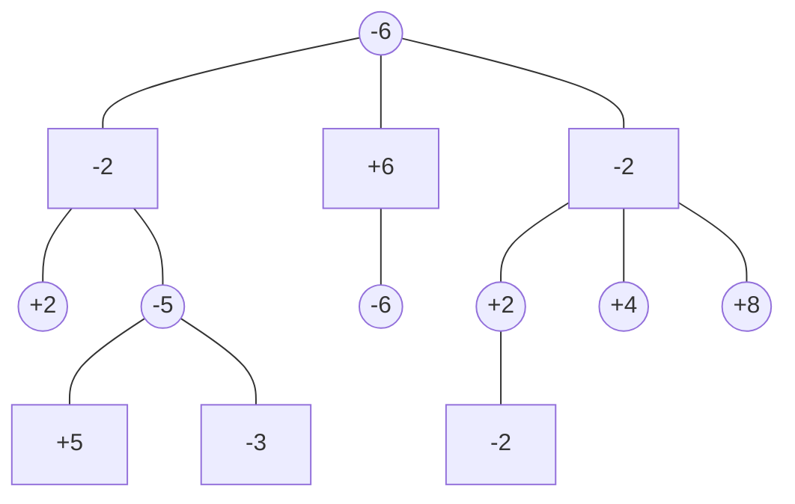

<script type="text/javascript" id="MathJax-script" async
  src="https://cdn.jsdelivr.net/npm/mathjax@3/es5/tex-mml-chtml.js">
</script>
<script>
  window.MathJax = {
    tex: { inlineMath: [['$', '$'], ['\\(', '\\)']] }
  };
</script>

The **Not Intelligent Chess Engine**, otherwise known as **NICE**, is a UCI chess engine that implements key learning principles using low-level languages. NICE is developed in **C++** for speed and efficiency, allowing us to utilize low-level operations and CPU instructions to further speed up the engine. The engine uses **Data-Oriented Design** principles, prioritizing performance over object-oriented data representation.

NICE is live on Lichess for all to try, challenge, and test its strength. It is comparable to Stockfish Level 5, with an estimated Elo rating of **1500-1700**.

**[Try the engine yourself here!](https://lichess.org/@/NICE_BOT)**

---

# Board Representation

There are typically 2 ways to represent they game board in an engine. Mailbox and Bitboards. 

## Mailbox

Mailbox is the more intuitive approach where the board is represented as an array of 64 elements where each element contains the ID of what type of piece is on that square.

The advantage of this representation is **lookup speed**. It takes $O(1)$ time complexity to look up what piece is on any specific square. This is helpful when checking if a square is occupied or capturing a piece.

The down side of this way of representing the board this way is there is no efficient way of knowing where each piece is for move generation. The only way to find out where pieces are is to loop through the entire array to identify what type of piece is on each square and then run the appropriate move generation for that piece. This means if there are only 3 pieces on the board we have to look through the entire board to find and identify the pieces rather than having some way of knowing where the pieces are instantly.

# Bitboards

Bitboard is a way of compressing the idea of the mailbox into a simple integer. It leverages the fact that there are 64 squares on the board and that modern computer hardware and CPUs have a 64-bit architecture. This means we can fit information of an entire board inside a single CPU register.

<table cellspacing="0" cellpadding="0" style="border: 4px solid #333; border-collapse: collapse; margin: 0 auto; font-family: 'Segoe UI Symbol', 'Arial Unicode MS', sans-serif;">
  <tr>
    <td style="width: 50px; height: 50px; padding:0; line-height: 50px; text-align: center; font-size: 25px; background-color: #f0d9b5; color: #b58863;">56</td>
    <td style="width: 50px; height: 50px; padding:0; line-height: 50px; text-align: center; font-size: 25px; background-color: #b58863; color: #f0d9b5;">57</td>
    <td style="width: 50px; height: 50px; padding:0; line-height: 50px; text-align: center; font-size: 25px; background-color: #f0d9b5; color: #b58863;">58</td>
    <td style="width: 50px; height: 50px; padding:0; line-height: 50px; text-align: center; font-size: 25px; background-color: #b58863; color: #f0d9b5;">59</td>
    <td style="width: 50px; height: 50px; padding:0; line-height: 50px; text-align: center; font-size: 25px; background-color: #f0d9b5; color: #b58863;">60</td>
    <td style="width: 50px; height: 50px; padding:0; line-height: 50px; text-align: center; font-size: 25px; background-color: #b58863; color: #f0d9b5;">61</td>
    <td style="width: 50px; height: 50px; padding:0; line-height: 50px; text-align: center; font-size: 25px; background-color: #f0d9b5; color: #b58863;">62</td>
    <td style="width: 50px; height: 50px; padding:0; line-height: 50px; text-align: center; font-size: 25px; background-color: #b58863; color: #f0d9b5;">63</td>
  </tr>
  <tr>
    <td style="width: 50px; height: 50px; padding:0; line-height: 50px; text-align: center; font-size: 25px; background-color: #b58863; color: #f0d9b5;">48</td>
    <td style="width: 50px; height: 50px; padding:0; line-height: 50px; text-align: center; font-size: 25px; background-color: #f0d9b5; color: #b58863;">49</td>
    <td style="width: 50px; height: 50px; padding:0; line-height: 50px; text-align: center; font-size: 25px; background-color: #b58863; color: #f0d9b5;">50</td>
    <td style="width: 50px; height: 50px; padding:0; line-height: 50px; text-align: center; font-size: 25px; background-color: #f0d9b5; color: #b58863;">51</td>
    <td style="width: 50px; height: 50px; padding:0; line-height: 50px; text-align: center; font-size: 25px; background-color: #b58863; color: #f0d9b5;">52</td>
    <td style="width: 50px; height: 50px; padding:0; line-height: 50px; text-align: center; font-size: 25px; background-color: #f0d9b5; color: #b58863;">53</td>
    <td style="width: 50px; height: 50px; padding:0; line-height: 50px; text-align: center; font-size: 25px; background-color: #b58863; color: #f0d9b5;">54</td>
    <td style="width: 50px; height: 50px; padding:0; line-height: 50px; text-align: center; font-size: 25px; background-color: #f0d9b5; color: #b58863;">55</td>
  </tr>
  <tr>
    <td style="width: 50px; height: 50px; padding:0; line-height: 50px; text-align: center; font-size: 25px; background-color: #f0d9b5; color: #b58863;">40</td>
    <td style="width: 50px; height: 50px; padding:0; line-height: 50px; text-align: center; font-size: 25px; background-color: #b58863; color: #f0d9b5;">41</td>
    <td style="width: 50px; height: 50px; padding:0; line-height: 50px; text-align: center; font-size: 25px; background-color: #f0d9b5; color: #b58863;">42</td>
    <td style="width: 50px; height: 50px; padding:0; line-height: 50px; text-align: center; font-size: 25px; background-color: #b58863; color: #f0d9b5;">43</td>
    <td style="width: 50px; height: 50px; padding:0; line-height: 50px; text-align: center; font-size: 25px; background-color: #f0d9b5; color: #b58863;">44</td>
    <td style="width: 50px; height: 50px; padding:0; line-height: 50px; text-align: center; font-size: 25px; background-color: #b58863; color: #f0d9b5;">45</td>
    <td style="width: 50px; height: 50px; padding:0; line-height: 50px; text-align: center; font-size: 25px; background-color: #f0d9b5; color: #b58863;">46</td>
    <td style="width: 50px; height: 50px; padding:0; line-height: 50px; text-align: center; font-size: 25px; background-color: #b58863; color: #f0d9b5;">47</td>
  </tr>
  <tr>
    <td style="width: 50px; height: 50px; padding:0; line-height: 50px; text-align: center; font-size: 25px; background-color: #b58863; color: #f0d9b5;">32</td>
    <td style="width: 50px; height: 50px; padding:0; line-height: 50px; text-align: center; font-size: 25px; background-color: #f0d9b5; color: #b58863;">33</td>
    <td style="width: 50px; height: 50px; padding:0; line-height: 50px; text-align: center; font-size: 25px; background-color: #b58863; color: #f0d9b5;">34</td>
    <td style="width: 50px; height: 50px; padding:0; line-height: 50px; text-align: center; font-size: 25px; background-color: #f0d9b5; color: #b58863;">35</td>
    <td style="width: 50px; height: 50px; padding:0; line-height: 50px; text-align: center; font-size: 25px; background-color: #b58863; color: #f0d9b5;">36</td>
    <td style="width: 50px; height: 50px; padding:0; line-height: 50px; text-align: center; font-size: 25px; background-color: #f0d9b5; color: #b58863;">37</td>
    <td style="width: 50px; height: 50px; padding:0; line-height: 50px; text-align: center; font-size: 25px; background-color: #b58863; color: #f0d9b5;">38</td>
    <td style="width: 50px; height: 50px; padding:0; line-height: 50px; text-align: center; font-size: 25px; background-color: #f0d9b5; color: #b58863;">39</td>
  </tr>
  <tr>
    <td style="width: 50px; height: 50px; padding:0; line-height: 50px; text-align: center; font-size: 25px; background-color: #f0d9b5; color: #b58863;">24</td>
    <td style="width: 50px; height: 50px; padding:0; line-height: 50px; text-align: center; font-size: 25px; background-color: #b58863; color: #f0d9b5;">25</td>
    <td style="width: 50px; height: 50px; padding:0; line-height: 50px; text-align: center; font-size: 25px; background-color: #f0d9b5; color: #b58863;">26</td>
    <td style="width: 50px; height: 50px; padding:0; line-height: 50px; text-align: center; font-size: 25px; background-color: #b58863; color: #f0d9b5;">27</td>
    <td style="width: 50px; height: 50px; padding:0; line-height: 50px; text-align: center; font-size: 25px; background-color: #f0d9b5; color: #b58863;">28</td>
    <td style="width: 50px; height: 50px; padding:0; line-height: 50px; text-align: center; font-size: 25px; background-color: #b58863; color: #f0d9b5;">29</td>
    <td style="width: 50px; height: 50px; padding:0; line-height: 50px; text-align: center; font-size: 25px; background-color: #f0d9b5; color: #b58863;">30</td>
    <td style="width: 50px; height: 50px; padding:0; line-height: 50px; text-align: center; font-size: 25px; background-color: #b58863; color: #f0d9b5;">31</td>
  </tr>
  <tr>
    <td style="width: 50px; height: 50px; padding:0; line-height: 50px; text-align: center; font-size: 25px; background-color: #b58863; color: #f0d9b5;">16</td>
    <td style="width: 50px; height: 50px; padding:0; line-height: 50px; text-align: center; font-size: 25px; background-color: #f0d9b5; color: #b58863;">17</td>
    <td style="width: 50px; height: 50px; padding:0; line-height: 50px; text-align: center; font-size: 25px; background-color: #b58863; color: #f0d9b5;">18</td>
    <td style="width: 50px; height: 50px; padding:0; line-height: 50px; text-align: center; font-size: 25px; background-color: #f0d9b5; color: #b58863;">19</td>
    <td style="width: 50px; height: 50px; padding:0; line-height: 50px; text-align: center; font-size: 25px; background-color: #b58863; color: #f0d9b5;">20</td>
    <td style="width: 50px; height: 50px; padding:0; line-height: 50px; text-align: center; font-size: 25px; background-color: #f0d9b5; color: #b58863;">21</td>
    <td style="width: 50px; height: 50px; padding:0; line-height: 50px; text-align: center; font-size: 25px; background-color: #b58863; color: #f0d9b5;">22</td>
    <td style="width: 50px; height: 50px; padding:0; line-height: 50px; text-align: center; font-size: 25px; background-color: #f0d9b5; color: #b58863;">23</td>
  </tr>
  <tr>
    <td style="width: 50px; height: 50px; padding:0; line-height: 50px; text-align: center; font-size: 25px; background-color: #f0d9b5; color: #b58863;">8</td>
    <td style="width: 50px; height: 50px; padding:0; line-height: 50px; text-align: center; font-size: 25px; background-color: #b58863; color: #f0d9b5;">9</td>
    <td style="width: 50px; height: 50px; padding:0; line-height: 50px; text-align: center; font-size: 25px; background-color: #f0d9b5; color: #b58863;">10</td>
    <td style="width: 50px; height: 50px; padding:0; line-height: 50px; text-align: center; font-size: 25px; background-color: #b58863; color: #f0d9b5;">11</td>
    <td style="width: 50px; height: 50px; padding:0; line-height: 50px; text-align: center; font-size: 25px; background-color: #f0d9b5; color: #b58863;">12</td>
    <td style="width: 50px; height: 50px; padding:0; line-height: 50px; text-align: center; font-size: 25px; background-color: #b58863; color: #f0d9b5;">13</td>
    <td style="width: 50px; height: 50px; padding:0; line-height: 50px; text-align: center; font-size: 25px; background-color: #f0d9b5; color: #b58863;">14</td>
    <td style="width: 50px; height: 50px; padding:0; line-height: 50px; text-align: center; font-size: 25px; background-color: #b58863; color: #f0d9b5;">15</td>
  </tr>
  <tr>
    <td style="width: 50px; height: 50px; padding:0; line-height: 50px; text-align: center; font-size: 25px; background-color: #b58863; color: #f0d9b5;">0</td>
    <td style="width: 50px; height: 50px; padding:0; line-height: 50px; text-align: center; font-size: 25px; background-color: #f0d9b5; color: #b58863;">1</td>
    <td style="width: 50px; height: 50px; padding:0; line-height: 50px; text-align: center; font-size: 25px; background-color: #b58863; color: #f0d9b5;">2</td>
    <td style="width: 50px; height: 50px; padding:0; line-height: 50px; text-align: center; font-size: 25px; background-color: #f0d9b5; color: #b58863;">3</td>
    <td style="width: 50px; height: 50px; padding:0; line-height: 50px; text-align: center; font-size: 25px; background-color: #b58863; color: #f0d9b5;">4</td>
    <td style="width: 50px; height: 50px; padding:0; line-height: 50px; text-align: center; font-size: 25px; background-color: #f0d9b5; color: #b58863;">5</td>
    <td style="width: 50px; height: 50px; padding:0; line-height: 50px; text-align: center; font-size: 25px; background-color: #b58863; color: #f0d9b5;">6</td>
    <td style="width: 50px; height: 50px; padding:0; line-height: 50px; text-align: center; font-size: 25px; background-color: #f0d9b5; color: #b58863;">7</td>
  </tr>
</table>

If we visualise the board being numbered as show above, we can map each square to 1 bit in a 64 bit unsigned integer.

<table cellspacing="0" cellpadding="0" style="border: 4px solid #333; border-collapse: collapse; margin: 0 auto; font-family: 'Segoe UI Symbol', 'Arial Unicode MS', sans-serif;">
  <tr>
    <td style="width: 50px; height: 50px; padding:0; line-height: 50px; text-align: center; font-size: 25px; background-color: #f0d9b5; color: #b58863;">56</td>
    <td style="width: 50px; height: 50px; padding:0; line-height: 50px; text-align: center; font-size: 25px; background-color: #b58863; color: #f0d9b5;">57</td>
    <td style="width: 50px; height: 50px; padding:0; line-height: 50px; text-align: center; font-size: 25px; background-color: #f0d9b5; color: #b58863;">58</td>
    <td style="width: 50px; height: 50px; padding:0; line-height: 50px; text-align: center; font-size: 25px; background-color: #b58863; color: #f0d9b5;">59</td>
    <td style="width: 50px; height: 50px; padding:0; line-height: 50px; text-align: center; font-size: 25px; background-color: #f0d9b5; color: #b58863;">60</td>
    <td style="width: 50px; height: 50px; padding:0; line-height: 50px; text-align: center; font-size: 25px; background-color: #b58863; color: #f0d9b5;">61</td>
    <td style="width: 50px; height: 50px; padding:0; line-height: 50px; text-align: center; font-size: 25px; background-color: #f0d9b5; color: #b58863;">62</td>
    <td style="width: 50px; height: 50px; padding:0; line-height: 50px; text-align: center; font-size: 25px; background-color: #b58863; color: #f0d9b5;">63</td>
  </tr>
  <tr>
    <td style="width: 50px; height: 50px; padding:0; line-height: 50px; text-align: center; font-size: 25px; background-color: #b58863; color: #f0d9b5;">48</td>
    <td style="width: 50px; height: 50px; padding:0; line-height: 50px; text-align: center; font-size: 25px; background-color: #f0d9b5; color: #b58863;">49</td>
    <td style="width: 50px; height: 50px; padding:0; line-height: 50px; text-align: center; font-size: 25px; background-color: #b58863; color: #f0d9b5;">50</td>
    <td style="width: 50px; height: 50px; padding:0; line-height: 50px; text-align: center; font-size: 25px; background-color: #f0d9b5; color: #b58863;">51</td>
    <td style="width: 50px; height: 50px; padding:0; line-height: 50px; text-align: center; font-size: 25px; background-color: #b58863; color: #f0d9b5;">52</td>
    <td style="width: 50px; height: 50px; padding:0; line-height: 50px; text-align: center; font-size: 25px; background-color: #f0d9b5; color: #b58863;">53</td>
    <td style="width: 50px; height: 50px; padding:0; line-height: 50px; text-align: center; font-size: 25px; background-color: #b58863; color: #f0d9b5;">54</td>
    <td style="width: 50px; height: 50px; padding:0; line-height: 50px; text-align: center; font-size: 25px; background-color: #f0d9b5; color: #b58863;">55</td>
  </tr>
  <tr>
    <td style="width: 50px; height: 50px; padding:0; line-height: 50px; text-align: center; font-size: 25px; background-color: #f0d9b5; color: #b58863;">40</td>
    <td style="width: 50px; height: 50px; padding:0; line-height: 50px; text-align: center; font-size: 25px; background-color: #b58863; color: #f0d9b5;">41</td>
    <td style="width: 50px; height: 50px; padding:0; line-height: 50px; text-align: center; font-size: 25px; background-color: #f0d9b5; color: #b58863;">42</td>
    <td style="width: 50px; height: 50px; padding:0; line-height: 50px; text-align: center; font-size: 25px; background-color: #b58863; color: #f0d9b5;">43</td>
    <td style="width: 50px; height: 50px; padding:0; line-height: 50px; text-align: center; font-size: 25px; background-color: #f0d9b5; color: #b58863;">44</td>
    <td style="width: 50px; height: 50px; padding:0; line-height: 50px; text-align: center; font-size: 25px; background-color: #b58863; color: #f0d9b5;">45</td>
    <td style="width: 50px; height: 50px; padding:0; line-height: 50px; text-align: center; font-size: 25px; background-color: #f0d9b5; color: #b58863;">46</td>
    <td style="width: 50px; height: 50px; padding:0; line-height: 50px; text-align: center; font-size: 25px; background-color: #b58863; color: #f0d9b5;">47</td>
  </tr>
  <tr>
    <td style="width: 50px; height: 50px; padding:0; line-height: 50px; text-align: center; font-size: 25px; background-color: #b58863; color: #f0d9b5;">32</td>
    <td style="width: 50px; height: 50px; padding:0; line-height: 50px; text-align: center; font-size: 25px; background-color: #f0d9b5; color: #b58863;">33</td>
    <td style="width: 50px; height: 50px; padding:0; line-height: 50px; text-align: center; font-size: 25px; background-color: #b58863; color: #f0d9b5;">34</td>
    <td style="width: 50px; height: 50px; padding:0; line-height: 50px; text-align: center; font-size: 25px; background-color: #f0d9b5; color: #b58863;">35</td>
    <td style="width: 50px; height: 50px; padding:0; line-height: 50px; text-align: center; font-size: 25px; background-color: #b58863; color: #f0d9b5;">36</td>
    <td style="width: 50px; height: 50px; padding:0; line-height: 50px; text-align: center; font-size: 25px; background-color: #f0d9b5; color: #b58863;">37</td>
    <td style="width: 50px; height: 50px; padding:0; line-height: 50px; text-align: center; font-size: 25px; background-color: #b58863; color: #f0d9b5;">38</td>
    <td style="width: 50px; height: 50px; padding:0; line-height: 50px; text-align: center; font-size: 25px; background-color: #f0d9b5; color: #b58863;">39</td>
  </tr>
  <tr>
    <td style="width: 50px; height: 50px; padding:0; line-height: 50px; text-align: center; font-size: 25px; background-color: #f0d9b5; color: #b58863;">24</td>
    <td style="width: 50px; height: 50px; padding:0; line-height: 50px; text-align: center; font-size: 25px; background-color: #b58863; color: #f0d9b5;">25</td>
    <td style="width: 50px; height: 50px; padding:0; line-height: 50px; text-align: center; font-size: 25px; background-color: #f0d9b5; color: #b58863;">26</td>
    <td style="width: 50px; height: 50px; padding:0; line-height: 50px; text-align: center; font-size: 25px; background-color: #b58863; color: #f0d9b5;">27</td>
    <td style="width: 50px; height: 50px; padding:0; line-height: 50px; text-align: center; font-size: 25px; background-color: #f0d9b5; color: #b58863;">28</td>
    <td style="width: 50px; height: 50px; padding:0; line-height: 50px; text-align: center; font-size: 25px; background-color: #b58863; color: #f0d9b5;">29</td>
    <td style="width: 50px; height: 50px; padding:0; line-height: 50px; text-align: center; font-size: 25px; background-color: #f0d9b5; color: #b58863;">30</td>
    <td style="width: 50px; height: 50px; padding:0; line-height: 50px; text-align: center; font-size: 25px; background-color: #b58863; color: #f0d9b5;">31</td>
  </tr>
  <tr>
    <td style="width: 50px; height: 50px; padding:0; line-height: 50px; text-align: center; font-size: 25px; background-color: #b58863; color: #f0d9b5;">16</td>
    <td style="width: 50px; height: 50px; padding:0; line-height: 50px; text-align: center; font-size: 25px; background-color: #f0d9b5; color: #b58863;">17</td>
    <td style="width: 50px; height: 50px; padding:0; line-height: 50px; text-align: center; font-size: 25px; background-color: #b58863; color: #f0d9b5;">18</td>
    <td style="width: 50px; height: 50px; padding:0; line-height: 50px; text-align: center; font-size: 25px; background-color: #f0d9b5; color: #b58863;">19</td>
    <td style="width: 50px; height: 50px; padding:0; line-height: 50px; text-align: center; font-size: 25px; background-color: #b58863; color: #f0d9b5;">20</td>
    <td style="width: 50px; height: 50px; padding:0; line-height: 50px; text-align: center; font-size: 25px; background-color: #f0d9b5; color: #b58863;">21</td>
    <td style="width: 50px; height: 50px; padding:0; line-height: 50px; text-align: center; font-size: 25px; background-color: #b58863; color: #f0d9b5;">22</td>
    <td style="width: 50px; height: 50px; padding:0; line-height: 50px; text-align: center; font-size: 25px; background-color: #f0d9b5; color: #b58863;">23</td>
  </tr>
  <tr>
    <td style="width: 50px; height: 50px; padding:0; line-height: 50px; text-align: center; font-size: 25px; background-color: #f0d9b5; color: black;">♙</td>
    <td style="width: 50px; height: 50px; padding:0; line-height: 50px; text-align: center; font-size: 25px; background-color: #b58863; color: black;">♙</td>
    <td style="width: 50px; height: 50px; padding:0; line-height: 50px; text-align: center; font-size: 25px; background-color: #f0d9b5; color: black;">♙</td>
    <td style="width: 50px; height: 50px; padding:0; line-height: 50px; text-align: center; font-size: 25px; background-color: #b58863; color: black;">♙</td>
    <td style="width: 50px; height: 50px; padding:0; line-height: 50px; text-align: center; font-size: 25px; background-color: #f0d9b5; color: black;">♙</td>
    <td style="width: 50px; height: 50px; padding:0; line-height: 50px; text-align: center; font-size: 25px; background-color: #b58863; color: black;">♙</td>
    <td style="width: 50px; height: 50px; padding:0; line-height: 50px; text-align: center; font-size: 25px; background-color: #f0d9b5; color: black;">♙</td>
    <td style="width: 50px; height: 50px; padding:0; line-height: 50px; text-align: center; font-size: 25px; background-color: #b58863; color: black;">♙</td>
  </tr>
  <tr>
    <td style="width: 50px; height: 50px; padding:0; line-height: 50px; text-align: center; font-size: 25px; background-color: #b58863; color: #f0d9b5;">0</td>
    <td style="width: 50px; height: 50px; padding:0; line-height: 50px; text-align: center; font-size: 25px; background-color: #f0d9b5; color: #b58863;">1</td>
    <td style="width: 50px; height: 50px; padding:0; line-height: 50px; text-align: center; font-size: 25px; background-color: #b58863; color: #f0d9b5;">2</td>
    <td style="width: 50px; height: 50px; padding:0; line-height: 50px; text-align: center; font-size: 25px; background-color: #f0d9b5; color: #b58863;">3</td>
    <td style="width: 50px; height: 50px; padding:0; line-height: 50px; text-align: center; font-size: 25px; background-color: #b58863; color: #f0d9b5;">4</td>
    <td style="width: 50px; height: 50px; padding:0; line-height: 50px; text-align: center; font-size: 25px; background-color: #f0d9b5; color: #b58863;">5</td>
    <td style="width: 50px; height: 50px; padding:0; line-height: 50px; text-align: center; font-size: 25px; background-color: #b58863; color: #f0d9b5;">6</td>
    <td style="width: 50px; height: 50px; padding:0; line-height: 50px; text-align: center; font-size: 25px; background-color: #f0d9b5; color: #b58863;">7</td>
  </tr>
</table>

This means the board above of pawns can be represented as a bitboard can be represented internally like this `0b00000000 00000000 00000000 00000000 00000000 00000000 11111111 00000000`.

In this example, bits 8 to 15 have been flipped to `1`, representing pieces occupying those squares.

The advantages of using a bitboard is that it is significantly faster as move generation is simply bitwise operations. Using boolean bitwise operations are extremely fast and checking attacked squares is as simple as applying a bitmask to the board. This drastically speeds up computations. With this representation is also possible to almost instantly get the position of pieces and the total number of pieces by leveraging CPU build in instructions `LSB` and `PopCount`.

The disadvantage of using bitboard is that they simply represent if a square is occupied or not. They do not tell you what type of piece is on the occupied square. Because of this you need one bitboard for each piece type. In the NICE engine it uses 13 bitboards to represent the entire board however that is only 104 bytes of memory which is till a small memory footprint compared to the mailbox approach which requires about 252 bytes.

## Hybrid

The hybrid approach for board representation is to use a combination of bitboards and mailbox. Noticing that the strengths of one representation are the weaknesses of the other and vice-versa. NICE uses both representations for the board and uses the appropriate data structure when doing computations to keep to each representations strengths. The only overhead is that it must be ensured that both board representations are kept synced to prevent board corruption and unintended behaviour.

# Move Generation

## What is a move?

A move is represented as a compact 32-bit integer. This is down for efficiency and to make the data structure as compact as possible.

The bits of a move are broken down as follows:

```
bits 0-5        : from square (0-63)  [6 bits needed]
bits 6-11       : to square (0-63)    [6 bits needed]
bits 12-17      : flags               [6 bits needed]
bits 18-21      : promoted to         [4 bits needed]
bits 22-25      : piece captured      [4 bits needed]
```

Move flags are things like castling, double pushing of pawns, captures and any extra information about a move.

## How are moves computed

There are two types of movements when it comes to chess pieces. Sliders and Leapers. Sliders are pieces that can slide up and down the board until they encounter another piece or blocker. Leapers "teleport" or leap to there target square without having to concern themselves with blockers. Using this we can categorise Rooks, Bishops and Queens as sliders and Knights, Kings and Pawns as leapers.

### Sliders

Using the offsets shown below we can calculate the next position of sliding pieces as these offsets act as cardinal direction. This is then looped until the piece encounters a blocker that prevents it from moving farther or reaches the edge of the board.

<table cellspacing="0" cellpadding="0" style="border: 4px solid #333; border-collapse: collapse; margin: 0 auto; font-family: 'Segoe UI Symbol', 'Arial Unicode MS', sans-serif;">
  <tr>
    <td style="width: 50px; height: 50px; padding:0; line-height: 50px; text-align: center; font-size: 25px; background-color: #f0d9b5; color: #b58863;"></td>
    <td style="width: 50px; height: 50px; padding:0; line-height: 50px; text-align: center; font-size: 25px; background-color: #b58863; color: #f0d9b5;"></td>
    <td style="width: 50px; height: 50px; padding:0; line-height: 50px; text-align: center; font-size: 25px; background-color: #f0d9b5; color: #b58863;"></td>
    <td style="width: 50px; height: 50px; padding:0; line-height: 50px; text-align: center; font-size: 25px; background-color: #b58863; color: #f0d9b5;"></td>
    <td style="width: 50px; height: 50px; padding:0; line-height: 50px; text-align: center; font-size: 25px; background-color: #f0d9b5; color: black;">+7</td>
    <td style="width: 50px; height: 50px; padding:0; line-height: 50px; text-align: center; font-size: 25px; background-color: #b58863; color: #f0d9b5;"></td>
    <td style="width: 50px; height: 50px; padding:0; line-height: 50px; text-align: center; font-size: 25px; background-color: #f0d9b5; color: black;">+9</td>
    <td style="width: 50px; height: 50px; padding:0; line-height: 50px; text-align: center; font-size: 25px; background-color: #b58863; color: #f0d9b5;"></td>
  </tr>
  <tr>
    <td style="width: 50px; height: 50px; padding:0; line-height: 50px; text-align: center; font-size: 25px; background-color: #b58863; color: #f0d9b5;"></td>
    <td style="width: 50px; height: 50px; padding:0; line-height: 50px; text-align: center; font-size: 25px; background-color: #f0d9b5; color: #b58863;"></td>
    <td style="width: 50px; height: 50px; padding:0; line-height: 50px; text-align: center; font-size: 25px; background-color: #b58863; color: #f0d9b5;"></td>
    <td style="width: 50px; height: 50px; padding:0; line-height: 50px; text-align: center; font-size: 25px; background-color: #f0d9b5; color: #b58863;"></td>
    <td style="width: 50px; height: 50px; padding:0; line-height: 50px; text-align: center; font-size: 25px; background-color: #b58863; color: #f0d9b5;"></td>
    <td style="width: 50px; height: 50px; padding:0; line-height: 50px; text-align: center; font-size: 25px; background-color: #f0d9b5; color: black;">♝</td>
    <td style="width: 50px; height: 50px; padding:0; line-height: 50px; text-align: center; font-size: 25px; background-color: #b58863; color: #f0d9b5;"></td>
    <td style="width: 50px; height: 50px; padding:0; line-height: 50px; text-align: center; font-size: 25px; background-color: #f0d9b5; color: #b58863;"></td>
  </tr>
  <tr>
    <td style="width: 50px; height: 50px; padding:0; line-height: 50px; text-align: center; font-size: 25px; background-color: #f0d9b5; color: #b58863;"></td>
    <td style="width: 50px; height: 50px; padding:0; line-height: 50px; text-align: center; font-size: 25px; background-color: #b58863; color: #f0d9b5;"></td>
    <td style="width: 50px; height: 50px; padding:0; line-height: 50px; text-align: center; font-size: 25px; background-color: #f0d9b5; color: #b58863;"></td>
    <td style="width: 50px; height: 50px; padding:0; line-height: 50px; text-align: center; font-size: 25px; background-color: #b58863; color: #f0d9b5;"></td>
    <td style="width: 50px; height: 50px; padding:0; line-height: 50px; text-align: center; font-size: 25px; background-color: #f0d9b5; color: black;">-9</td>
    <td style="width: 50px; height: 50px; padding:0; line-height: 50px; text-align: center; font-size: 25px; background-color: #b58863; color: #f0d9b5;"></td>
    <td style="width: 50px; height: 50px; padding:0; line-height: 50px; text-align: center; font-size: 25px; background-color: #f0d9b5; color: black;">-7</td>
    <td style="width: 50px; height: 50px; padding:0; line-height: 50px; text-align: center; font-size: 25px; background-color: #b58863; color: #f0d9b5;"></td>
  </tr>
  <tr>
    <td style="width: 50px; height: 50px; padding:0; line-height: 50px; text-align: center; font-size: 25px; background-color: #b58863; color: #f0d9b5;"></td>
    <td style="width: 50px; height: 50px; padding:0; line-height: 50px; text-align: center; font-size: 25px; background-color: #f0d9b5; color: #b58863;"></td>
    <td style="width: 50px; height: 50px; padding:0; line-height: 50px; text-align: center; font-size: 25px; background-color: #b58863; color: #f0d9b5;"></td>
    <td style="width: 50px; height: 50px; padding:0; line-height: 50px; text-align: center; font-size: 25px; background-color: #f0d9b5; color: black;">+8</td>
    <td style="width: 50px; height: 50px; padding:0; line-height: 50px; text-align: center; font-size: 25px; background-color: #b58863; color: #f0d9b5;"></td>
    <td style="width: 50px; height: 50px; padding:0; line-height: 50px; text-align: center; font-size: 25px; background-color: #f0d9b5; color: #b58863;"></td>
    <td style="width: 50px; height: 50px; padding:0; line-height: 50px; text-align: center; font-size: 25px; background-color: #b58863; color: #f0d9b5;"></td>
    <td style="width: 50px; height: 50px; padding:0; line-height: 50px; text-align: center; font-size: 25px; background-color: #f0d9b5; color: #b58863;"></td>
  </tr>
  <tr>
    <td style="width: 50px; height: 50px; padding:0; line-height: 50px; text-align: center; font-size: 25px; background-color: #f0d9b5; color: #b58863;"></td>
    <td style="width: 50px; height: 50px; padding:0; line-height: 50px; text-align: center; font-size: 25px; background-color: #b58863; color: #f0d9b5;"></td>
    <td style="width: 50px; height: 50px; padding:0; line-height: 50px; text-align: center; font-size: 25px; background-color: #f0d9b5; color: black;">-1</td>
    <td style="width: 50px; height: 50px; padding:0; line-height: 50px; text-align: center; font-size: 25px; background-color: #b58863; color: black;">♜</td>
    <td style="width: 50px; height: 50px; padding:0; line-height: 50px; text-align: center; font-size: 25px; background-color: #f0d9b5; color: black;">+1</td>
    <td style="width: 50px; height: 50px; padding:0; line-height: 50px; text-align: center; font-size: 25px; background-color: #b58863; color: #f0d9b5;"></td>
    <td style="width: 50px; height: 50px; padding:0; line-height: 50px; text-align: center; font-size: 25px; background-color: #f0d9b5; color: #b58863;"></td>
    <td style="width: 50px; height: 50px; padding:0; line-height: 50px; text-align: center; font-size: 25px; background-color: #b58863; color: #f0d9b5;"></td>
  </tr>
  <tr>
    <td style="width: 50px; height: 50px; padding:0; line-height: 50px; text-align: center; font-size: 25px; background-color: #b58863; color: #f0d9b5;"></td>
    <td style="width: 50px; height: 50px; padding:0; line-height: 50px; text-align: center; font-size: 25px; background-color: #f0d9b5; color: #b58863;"></td>
    <td style="width: 50px; height: 50px; padding:0; line-height: 50px; text-align: center; font-size: 25px; background-color: #b58863; color: #f0d9b5;"></td>
    <td style="width: 50px; height: 50px; padding:0; line-height: 50px; text-align: center; font-size: 25px; background-color: #f0d9b5; color: black;">-8</td>
    <td style="width: 50px; height: 50px; padding:0; line-height: 50px; text-align: center; font-size: 25px; background-color: #b58863; color: #f0d9b5;"></td>
    <td style="width: 50px; height: 50px; padding:0; line-height: 50px; text-align: center; font-size: 25px; background-color: #f0d9b5; color: #b58863;"></td>
    <td style="width: 50px; height: 50px; padding:0; line-height: 50px; text-align: center; font-size: 25px; background-color: #b58863; color: #f0d9b5;"></td>
    <td style="width: 50px; height: 50px; padding:0; line-height: 50px; text-align: center; font-size: 25px; background-color: #f0d9b5; color: #b58863;"></td>
  </tr>
  <tr>
    <td style="width: 50px; height: 50px; padding:0; line-height: 50px; text-align: center; font-size: 25px; background-color: #f0d9b5; color: #b58863;"></td>
    <td style="width: 50px; height: 50px; padding:0; line-height: 50px; text-align: center; font-size: 25px; background-color: #b58863; color: #f0d9b5;"></td>
    <td style="width: 50px; height: 50px; padding:0; line-height: 50px; text-align: center; font-size: 25px; background-color: #f0d9b5; color: #b58863;"></td>
    <td style="width: 50px; height: 50px; padding:0; line-height: 50px; text-align: center; font-size: 25px; background-color: #b58863; color: #f0d9b5;"></td>
    <td style="width: 50px; height: 50px; padding:0; line-height: 50px; text-align: center; font-size: 25px; background-color: #f0d9b5; color: #b58863;"></td>
    <td style="width: 50px; height: 50px; padding:0; line-height: 50px; text-align: center; font-size: 25px; background-color: #b58863; color: #f0d9b5;"></td>
    <td style="width: 50px; height: 50px; padding:0; line-height: 50px; text-align: center; font-size: 25px; background-color: #f0d9b5; color: #b58863;"></td>
    <td style="width: 50px; height: 50px; padding:0; line-height: 50px; text-align: center; font-size: 25px; background-color: #b58863; color: #f0d9b5;"></td>
  </tr>
  <tr>
    <td style="width: 50px; height: 50px; padding:0; line-height: 50px; text-align: center; font-size: 25px; background-color: #b58863; color: #f0d9b5;"></td>
    <td style="width: 50px; height: 50px; padding:0; line-height: 50px; text-align: center; font-size: 25px; background-color: #f0d9b5; color: #b58863;"></td>
    <td style="width: 50px; height: 50px; padding:0; line-height: 50px; text-align: center; font-size: 25px; background-color: #b58863; color: #f0d9b5;"></td>
    <td style="width: 50px; height: 50px; padding:0; line-height: 50px; text-align: center; font-size: 25px; background-color: #f0d9b5; color: #b58863;"></td>
    <td style="width: 50px; height: 50px; padding:0; line-height: 50px; text-align: center; font-size: 25px; background-color: #b58863; color: #f0d9b5;"></td>
    <td style="width: 50px; height: 50px; padding:0; line-height: 50px; text-align: center; font-size: 25px; background-color: #f0d9b5; color: #b58863;"></td>
    <td style="width: 50px; height: 50px; padding:0; line-height: 50px; text-align: center; font-size: 25px; background-color: #b58863; color: #f0d9b5;"></td>
    <td style="width: 50px; height: 50px; padding:0; line-height: 50px; text-align: center; font-size: 25px; background-color: #f0d9b5; color: #b58863;"></td>
  </tr>
</table>

### Leapers

Since a Knight at square E4 always attacks the same squares, we don't need to calculate this at runtime. We pre-compute look-up tables for all 64 squares. Generating a Knight move is just a single array lookup: Attacks = KnightTable[square_index]. This is true for kings as well.

<table cellspacing="0" cellpadding="0" style="border: 4px solid #333; border-collapse: collapse; margin: 0 auto; font-family: 'Segoe UI Symbol', 'Arial Unicode MS', sans-serif;">
  <tr>
    <td style="width: 50px; height: 50px; padding:0; line-height: 50px; text-align: center; font-size: 25px; background-color: #f0d9b5; color: #b58863;"></td>
    <td style="width: 50px; height: 50px; padding:0; line-height: 50px; text-align: center; font-size: 25px; background-color: #b58863; color: #f0d9b5;"></td>
    <td style="width: 50px; height: 50px; padding:0; line-height: 50px; text-align: center; font-size: 25px; background-color: #f0d9b5; color: #b58863;"></td>
    <td style="width: 50px; height: 50px; padding:0; line-height: 50px; text-align: center; font-size: 25px; background-color: #b58863; color: #f0d9b5;"></td>
    <td style="width: 50px; height: 50px; padding:0; line-height: 50px; text-align: center; font-size: 25px; background-color: #f0d9b5; color: #b58863;"></td>
    <td style="width: 50px; height: 50px; padding:0; line-height: 50px; text-align: center; font-size: 25px; background-color: #b58863; color: #f0d9b5;"></td>
    <td style="width: 50px; height: 50px; padding:0; line-height: 50px; text-align: center; font-size: 25px; background-color: #f0d9b5; color: #b58863;"></td>
    <td style="width: 50px; height: 50px; padding:0; line-height: 50px; text-align: center; font-size: 25px; background-color: #b58863; color: #f0d9b5;"></td>
  </tr>
  <tr>
    <td style="width: 50px; height: 50px; padding:0; line-height: 50px; text-align: center; font-size: 25px; background-color: #b58863; color: #f0d9b5;"></td>
    <td style="width: 50px; height: 50px; padding:0; line-height: 50px; text-align: center; font-size: 25px; background-color: #f0d9b5; color: #b58863;"></td>
    <td style="width: 50px; height: 50px; padding:0; line-height: 50px; text-align: center; font-size: 25px; background-color: #b58863; color: #f0d9b5;"></td>
    <td style="width: 50px; height: 50px; padding:0; line-height: 50px; text-align: center; font-size: 25px; background-color: #f0d9b5; color: #b58863;"></td>
    <td style="width: 50px; height: 50px; padding:0; line-height: 50px; text-align: center; font-size: 25px; background-color: #b58863; color: #f0d9b5;"></td>
    <td style="width: 50px; height: 50px; padding:0; line-height: 50px; text-align: center; font-size: 25px; background-color: #f0d9b5; color: #b58863;"></td>
    <td style="width: 50px; height: 50px; padding:0; line-height: 50px; text-align: center; font-size: 25px; background-color: #b58863; color: #f0d9b5;"></td>
    <td style="width: 50px; height: 50px; padding:0; line-height: 50px; text-align: center; font-size: 25px; background-color: #f0d9b5; color: #b58863;"></td>
  </tr>
  <tr>
    <td style="width: 50px; height: 50px; padding:0; line-height: 50px; text-align: center; font-size: 25px; background-color: #f0d9b5; color: #b58863;"></td>
    <td style="width: 50px; height: 50px; padding:0; line-height: 50px; text-align: center; font-size: 25px; background-color: #b58863; color: #f0d9b5;"></td>
    <td style="width: 50px; height: 50px; padding:0; line-height: 50px; text-align: center; font-size: 25px; background-color: #f0d9b5; color: #b58863;"></td>
    <td style="width: 50px; height: 50px; padding:0; line-height: 50px; text-align: center; font-size: 25px; background-color: #b58863; color: black;">X</td>
    <td style="width: 50px; height: 50px; padding:0; line-height: 50px; text-align: center; font-size: 25px; background-color: #f0d9b5; color: #b58863;"></td>
    <td style="width: 50px; height: 50px; padding:0; line-height: 50px; text-align: center; font-size: 25px; background-color: #b58863; color: black;">X</td>
    <td style="width: 50px; height: 50px; padding:0; line-height: 50px; text-align: center; font-size: 25px; background-color: #f0d9b5; color: #b58863;"></td>
    <td style="width: 50px; height: 50px; padding:0; line-height: 50px; text-align: center; font-size: 25px; background-color: #b58863; color: #f0d9b5;"></td>
  </tr>
  <tr>
    <td style="width: 50px; height: 50px; padding:0; line-height: 50px; text-align: center; font-size: 25px; background-color: #b58863; color: #f0d9b5;"></td>
    <td style="width: 50px; height: 50px; padding:0; line-height: 50px; text-align: center; font-size: 25px; background-color: #f0d9b5; color: #b58863;"></td>
    <td style="width: 50px; height: 50px; padding:0; line-height: 50px; text-align: center; font-size: 25px; background-color: #b58863; color: black;">X</td>
    <td style="width: 50px; height: 50px; padding:0; line-height: 50px; text-align: center; font-size: 25px; background-color: #f0d9b5; color: #b58863;"></td>
    <td style="width: 50px; height: 50px; padding:0; line-height: 50px; text-align: center; font-size: 25px; background-color: #b58863; color: #f0d9b5;"></td>
    <td style="width: 50px; height: 50px; padding:0; line-height: 50px; text-align: center; font-size: 25px; background-color: #f0d9b5; color: #b58863;"></td>
    <td style="width: 50px; height: 50px; padding:0; line-height: 50px; text-align: center; font-size: 25px; background-color: #b58863; color: black;">X</td>
    <td style="width: 50px; height: 50px; padding:0; line-height: 50px; text-align: center; font-size: 25px; background-color: #f0d9b5; color: #b58863;"></td>
  </tr>
  <tr>
    <td style="width: 50px; height: 50px; padding:0; line-height: 50px; text-align: center; font-size: 25px; background-color: #f0d9b5; color: #b58863;"></td>
    <td style="width: 50px; height: 50px; padding:0; line-height: 50px; text-align: center; font-size: 25px; background-color: #b58863; color: #f0d9b5;"></td>
    <td style="width: 50px; height: 50px; padding:0; line-height: 50px; text-align: center; font-size: 25px; background-color: #f0d9b5; color: #b58863;"></td>
    <td style="width: 50px; height: 50px; padding:0; line-height: 50px; text-align: center; font-size: 25px; background-color: #b58863; color: #f0d9b5;"></td>
    <td style="width: 50px; height: 50px; padding:0; line-height: 50px; text-align: center; font-size: 25px; background-color: #f0d9b5; color: black;">♘</td>
    <td style="width: 50px; height: 50px; padding:0; line-height: 50px; text-align: center; font-size: 25px; background-color: #b58863; color: #f0d9b5;"></td>
    <td style="width: 50px; height: 50px; padding:0; line-height: 50px; text-align: center; font-size: 25px; background-color: #f0d9b5; color: #b58863;"></td>
    <td style="width: 50px; height: 50px; padding:0; line-height: 50px; text-align: center; font-size: 25px; background-color: #b58863; color: #f0d9b5;"></td>
  </tr>
  <tr>
    <td style="width: 50px; height: 50px; padding:0; line-height: 50px; text-align: center; font-size: 25px; background-color: #b58863; color: #f0d9b5;"></td>
    <td style="width: 50px; height: 50px; padding:0; line-height: 50px; text-align: center; font-size: 25px; background-color: #f0d9b5; color: #b58863;"></td>
    <td style="width: 50px; height: 50px; padding:0; line-height: 50px; text-align: center; font-size: 25px; background-color: #b58863; color: black;">X</td>
    <td style="width: 50px; height: 50px; padding:0; line-height: 50px; text-align: center; font-size: 25px; background-color: #f0d9b5; color: #b58863;"></td>
    <td style="width: 50px; height: 50px; padding:0; line-height: 50px; text-align: center; font-size: 25px; background-color: #b58863; color: #f0d9b5;"></td>
    <td style="width: 50px; height: 50px; padding:0; line-height: 50px; text-align: center; font-size: 25px; background-color: #f0d9b5; color: #b58863;"></td>
    <td style="width: 50px; height: 50px; padding:0; line-height: 50px; text-align: center; font-size: 25px; background-color: #b58863; color: black;">X</td>
    <td style="width: 50px; height: 50px; padding:0; line-height: 50px; text-align: center; font-size: 25px; background-color: #f0d9b5; color: #b58863;"></td>
  </tr>
  <tr>
    <td style="width: 50px; height: 50px; padding:0; line-height: 50px; text-align: center; font-size: 25px; background-color: #f0d9b5; color: #b58863;"></td>
    <td style="width: 50px; height: 50px; padding:0; line-height: 50px; text-align: center; font-size: 25px; background-color: #b58863; color: #f0d9b5;"></td>
    <td style="width: 50px; height: 50px; padding:0; line-height: 50px; text-align: center; font-size: 25px; background-color: #f0d9b5; color: #b58863;"></td>
    <td style="width: 50px; height: 50px; padding:0; line-height: 50px; text-align: center; font-size: 25px; background-color: #b58863; color: black;">X</td>
    <td style="width: 50px; height: 50px; padding:0; line-height: 50px; text-align: center; font-size: 25px; background-color: #f0d9b5; color: #b58863;"></td>
    <td style="width: 50px; height: 50px; padding:0; line-height: 50px; text-align: center; font-size: 25px; background-color: #b58863; color: black;">X</td>
    <td style="width: 50px; height: 50px; padding:0; line-height: 50px; text-align: center; font-size: 25px; background-color: #f0d9b5; color: #b58863;"></td>
    <td style="width: 50px; height: 50px; padding:0; line-height: 50px; text-align: center; font-size: 25px; background-color: #b58863; color: #f0d9b5;"></td>
  </tr>
  <tr>
    <td style="width: 50px; height: 50px; padding:0; line-height: 50px; text-align: center; font-size: 25px; background-color: #b58863; color: #f0d9b5;"></td>
    <td style="width: 50px; height: 50px; padding:0; line-height: 50px; text-align: center; font-size: 25px; background-color: #f0d9b5; color: #b58863;"></td>
    <td style="width: 50px; height: 50px; padding:0; line-height: 50px; text-align: center; font-size: 25px; background-color: #b58863; color: #f0d9b5;"></td>
    <td style="width: 50px; height: 50px; padding:0; line-height: 50px; text-align: center; font-size: 25px; background-color: #f0d9b5; color: #b58863;"></td>
    <td style="width: 50px; height: 50px; padding:0; line-height: 50px; text-align: center; font-size: 25px; background-color: #b58863; color: #f0d9b5;"></td>
    <td style="width: 50px; height: 50px; padding:0; line-height: 50px; text-align: center; font-size: 25px; background-color: #f0d9b5; color: #b58863;"></td>
    <td style="width: 50px; height: 50px; padding:0; line-height: 50px; text-align: center; font-size: 25px; background-color: #b58863; color: #f0d9b5;"></td>
    <td style="width: 50px; height: 50px; padding:0; line-height: 50px; text-align: center; font-size: 25px; background-color: #f0d9b5; color: #b58863;"></td>
  </tr>
</table>

Pawns are unique. They move like sliders (forward) but capture like leapers (diagonally). We handle them with specific bitmasks that account for "En Passant" and double-push rules.

# Board Evaluation

Board evaluation is primarily dominated by material value. This is a simple way to evaluate board positions but is effective for a start. This also allows the engine to think tactically and favour moves that result in the loss of material for the opponent. 

For strategic evaluation Piece-Square-Tables were implemented. This was done as with material evaluation alone, the engine could be a tactical genius at a high depth but has not concept of positional and strategic play. This can result in the engine putting pieces on squares that they don't really belong, like a knight on the edge of the board. 

Piece-Square-Tables (PST) assign an extra bonus when pieces are placed on more optimal squares. The image below shows an example of how the bonuses look for the knight PST.

<table cellspacing="0" cellpadding="0" style="border: 4px solid #333; border-collapse: collapse; margin: 0 auto; font-family: 'Segoe UI Symbol', 'Arial Unicode MS', sans-serif;">
  <tr>
    <td style="width: 50px; height: 50px; padding:0; line-height: 50px; text-align: center; font-size: 26px; background-color: #f0d9b5; color: black;">-50</td>
    <td style="width: 50px; height: 50px; padding:0; line-height: 50px; text-align: center; font-size: 26px; background-color: #b58863; color: black;">-40</td>
    <td style="width: 50px; height: 50px; padding:0; line-height: 50px; text-align: center; font-size: 26px; background-color: #f0d9b5; color: black;">-30</td>
    <td style="width: 50px; height: 50px; padding:0; line-height: 50px; text-align: center; font-size: 26px; background-color: #b58863; color: black;">-30</td>
    <td style="width: 50px; height: 50px; padding:0; line-height: 50px; text-align: center; font-size: 26px; background-color: #f0d9b5; color: black;">-30</td>
    <td style="width: 50px; height: 50px; padding:0; line-height: 50px; text-align: center; font-size: 26px; background-color: #b58863; color: black;">-30</td>
    <td style="width: 50px; height: 50px; padding:0; line-height: 50px; text-align: center; font-size: 26px; background-color: #f0d9b5; color: black;">-40</td>
    <td style="width: 50px; height: 50px; padding:0; line-height: 50px; text-align: center; font-size: 26px; background-color: #b58863; color: black;">-50</td>
  </tr>
  <tr>
    <td style="width: 50px; height: 50px; padding:0; line-height: 50px; text-align: center; font-size: 26px; background-color: #b58863; color: black;">-40</td>
    <td style="width: 50px; height: 50px; padding:0; line-height: 50px; text-align: center; font-size: 26px; background-color: #f0d9b5; color: black;">-20</td>
    <td style="width: 50px; height: 50px; padding:0; line-height: 50px; text-align: center; font-size: 26px; background-color: #b58863; color: black;">0</td>
    <td style="width: 50px; height: 50px; padding:0; line-height: 50px; text-align: center; font-size: 26px; background-color: #f0d9b5; color: black;">0</td>
    <td style="width: 50px; height: 50px; padding:0; line-height: 50px; text-align: center; font-size: 26px; background-color: #b58863; color: black;">0</td>
    <td style="width: 50px; height: 50px; padding:0; line-height: 50px; text-align: center; font-size: 26px; background-color: #f0d9b5; color: black;">0</td>
    <td style="width: 50px; height: 50px; padding:0; line-height: 50px; text-align: center; font-size: 26px; background-color: #b58863; color: black;">-20</td>
    <td style="width: 50px; height: 50px; padding:0; line-height: 50px; text-align: center; font-size: 26px; background-color: #f0d9b5; color: black;">-40</td>
  </tr>
  <tr>
    <td style="width: 50px; height: 50px; padding:0; line-height: 50px; text-align: center; font-size: 26px; background-color: #f0d9b5; color: black;">-30</td>
    <td style="width: 50px; height: 50px; padding:0; line-height: 50px; text-align: center; font-size: 26px; background-color: #b58863; color: black;">0</td>
    <td style="width: 50px; height: 50px; padding:0; line-height: 50px; text-align: center; font-size: 26px; background-color: #f0d9b5; color: black;">10</td>
    <td style="width: 50px; height: 50px; padding:0; line-height: 50px; text-align: center; font-size: 26px; background-color: #b58863; color: black;">15</td>
    <td style="width: 50px; height: 50px; padding:0; line-height: 50px; text-align: center; font-size: 26px; background-color: #f0d9b5; color: black;">15</td>
    <td style="width: 50px; height: 50px; padding:0; line-height: 50px; text-align: center; font-size: 26px; background-color: #b58863; color: black;">10</td>
    <td style="width: 50px; height: 50px; padding:0; line-height: 50px; text-align: center; font-size: 26px; background-color: #f0d9b5; color: black;">0</td>
    <td style="width: 50px; height: 50px; padding:0; line-height: 50px; text-align: center; font-size: 26px; background-color: #b58863; color: black;">-30</td>
  </tr>
  <tr>
    <td style="width: 50px; height: 50px; padding:0; line-height: 50px; text-align: center; font-size: 26px; background-color: #b58863; color: black;">-30</td>
    <td style="width: 50px; height: 50px; padding:0; line-height: 50px; text-align: center; font-size: 26px; background-color: #f0d9b5; color: black;">5</td>
    <td style="width: 50px; height: 50px; padding:0; line-height: 50px; text-align: center; font-size: 26px; background-color: #b58863; color: black;">15</td>
    <td style="width: 50px; height: 50px; padding:0; line-height: 50px; text-align: center; font-size: 26px; background-color: #f0d9b5; color: black;">20</td>
    <td style="width: 50px; height: 50px; padding:0; line-height: 50px; text-align: center; font-size: 26px; background-color: #b58863; color: black;">20</td>
    <td style="width: 50px; height: 50px; padding:0; line-height: 50px; text-align: center; font-size: 26px; background-color: #f0d9b5; color: black;">15</td>
    <td style="width: 50px; height: 50px; padding:0; line-height: 50px; text-align: center; font-size: 26px; background-color: #b58863; color: black;">5</td>
    <td style="width: 50px; height: 50px; padding:0; line-height: 50px; text-align: center; font-size: 26px; background-color: #f0d9b5; color: black;">-30</td>
  </tr>
  <tr>
    <td style="width: 50px; height: 50px; padding:0; line-height: 50px; text-align: center; font-size: 26px; background-color: #f0d9b5; color: black;">-30</td>
    <td style="width: 50px; height: 50px; padding:0; line-height: 50px; text-align: center; font-size: 26px; background-color: #b58863; color: black;">0</td>
    <td style="width: 50px; height: 50px; padding:0; line-height: 50px; text-align: center; font-size: 26px; background-color: #f0d9b5; color: black;">15</td>
    <td style="width: 50px; height: 50px; padding:0; line-height: 50px; text-align: center; font-size: 26px; background-color: #b58863; color: black;">20</td>
    <td style="width: 50px; height: 50px; padding:0; line-height: 50px; text-align: center; font-size: 26px; background-color: #f0d9b5; color: black;">20</td>
    <td style="width: 50px; height: 50px; padding:0; line-height: 50px; text-align: center; font-size: 26px; background-color: #b58863; color: black;">15</td>
    <td style="width: 50px; height: 50px; padding:0; line-height: 50px; text-align: center; font-size: 26px; background-color: #f0d9b5; color: black;">0</td>
    <td style="width: 50px; height: 50px; padding:0; line-height: 50px; text-align: center; font-size: 26px; background-color: #b58863; color: black;">-30</td>
  </tr>
  <tr>
    <td style="width: 50px; height: 50px; padding:0; line-height: 50px; text-align: center; font-size: 26px; background-color: #b58863; color: black;">-30</td>
    <td style="width: 50px; height: 50px; padding:0; line-height: 50px; text-align: center; font-size: 26px; background-color: #f0d9b5; color: black;">5</td>
    <td style="width: 50px; height: 50px; padding:0; line-height: 50px; text-align: center; font-size: 26px; background-color: #b58863; color: black;">10</td>
    <td style="width: 50px; height: 50px; padding:0; line-height: 50px; text-align: center; font-size: 26px; background-color: #f0d9b5; color: black;">15</td>
    <td style="width: 50px; height: 50px; padding:0; line-height: 50px; text-align: center; font-size: 26px; background-color: #b58863; color: black;">15</td>
    <td style="width: 50px; height: 50px; padding:0; line-height: 50px; text-align: center; font-size: 26px; background-color: #f0d9b5; color: black;">10</td>
    <td style="width: 50px; height: 50px; padding:0; line-height: 50px; text-align: center; font-size: 26px; background-color: #b58863; color: black;">5</td>
    <td style="width: 50px; height: 50px; padding:0; line-height: 50px; text-align: center; font-size: 26px; background-color: #f0d9b5; color: black;">-30</td>
  </tr>
  <tr>
    <td style="width: 50px; height: 50px; padding:0; line-height: 50px; text-align: center; font-size: 26px; background-color: #f0d9b5; color: black;">-40</td>
    <td style="width: 50px; height: 50px; padding:0; line-height: 50px; text-align: center; font-size: 26px; background-color: #b58863; color: black;">-20</td>
    <td style="width: 50px; height: 50px; padding:0; line-height: 50px; text-align: center; font-size: 26px; background-color: #f0d9b5; color: black;">0</td>
    <td style="width: 50px; height: 50px; padding:0; line-height: 50px; text-align: center; font-size: 26px; background-color: #b58863; color: black;">5</td>
    <td style="width: 50px; height: 50px; padding:0; line-height: 50px; text-align: center; font-size: 26px; background-color: #f0d9b5; color: black;">5</td>
    <td style="width: 50px; height: 50px; padding:0; line-height: 50px; text-align: center; font-size: 26px; background-color: #b58863; color: black;">0</td>
    <td style="width: 50px; height: 50px; padding:0; line-height: 50px; text-align: center; font-size: 26px; background-color: #f0d9b5; color: black;">-20</td>
    <td style="width: 50px; height: 50px; padding:0; line-height: 50px; text-align: center; font-size: 26px; background-color: #b58863; color: black;">-40</td>
  </tr>
  <tr>
    <td style="width: 50px; height: 50px; padding:0; line-height: 50px; text-align: center; font-size: 26px; background-color: #b58863; color: black;">-50</td>
    <td style="width: 50px; height: 50px; padding:0; line-height: 50px; text-align: center; font-size: 26px; background-color: #f0d9b5; color: black;">-40</td>
    <td style="width: 50px; height: 50px; padding:0; line-height: 50px; text-align: center; font-size: 26px; background-color: #b58863; color: black;">-30</td>
    <td style="width: 50px; height: 50px; padding:0; line-height: 50px; text-align: center; font-size: 26px; background-color: #f0d9b5; color: black;">-30</td>
    <td style="width: 50px; height: 50px; padding:0; line-height: 50px; text-align: center; font-size: 26px; background-color: #b58863; color: black;">-30</td>
    <td style="width: 50px; height: 50px; padding:0; line-height: 50px; text-align: center; font-size: 26px; background-color: #f0d9b5; color: black;">-30</td>
    <td style="width: 50px; height: 50px; padding:0; line-height: 50px; text-align: center; font-size: 26px; background-color: #b58863; color: black;">-40</td>
    <td style="width: 50px; height: 50px; padding:0; line-height: 50px; text-align: center; font-size: 26px; background-color: #f0d9b5; color: black;">-50</td>
  </tr>
</table>

As you can see the PST incentivises the knights to be in the centre of the board where they can oversea many squares and punishes putting the knights on the edge of the board as "knights on the rim are dim".

# Search

To search and evaluate position, NICE implements a negamax search with alpha-beta pruning. Negamax is an optimisation on minimax based on the fact that what is good for you is bad for the opponent. 

$$negamax(a, b) = -negamax(-a, -b)$$

This is a recursive function that will recursively search to a specified depth at each move in a position and call the evaluation function on the leaf nodes. This results in an evaluation tree similar to the one below.



Alpha-beta pruning allows the engine to "cuttoff" branches in the true as there is already a better know solution before evaluation, this allows for large sections of the tree to be skipped drastically increasing evaluation time.

The pruning is only effective if good moves are evaluated first. To do this, move ordering was implemented. This enforces fundamental chess principles such as looking at forcing moves before quiet moves. 

The concept of killer moves has also been implemented. Killer moves are moves that are so good in a particular position that they take precedence. This is used as a search heuristic so the search can look in the best direction

Killer moves are moves that are already known to be good so it drastically improves speed up when considered for move ordering. 